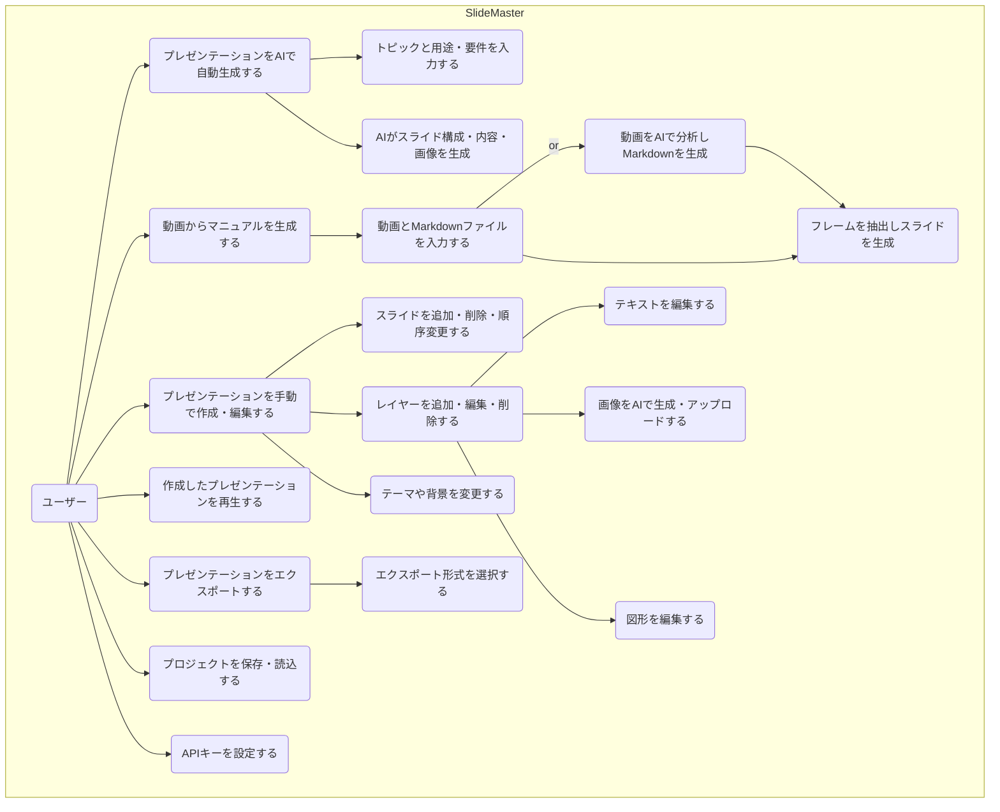

# 1. 要件定義書 - SlideMaster

## 1.1. 概要

本ドキュメントは、AIプレゼンテーション作成ツール「SlideMaster」の要件を定義するものです。

## 1.2. プロジェクトの目的

SlideMasterは、ユーザーが簡単な指示（トピック）や既存のコンテンツ（動画、Markdown）を入力するだけで、AIが自動的に構成、テキスト、デザイン、画像を生成し、高品質なプレゼンテーションを作成することを目的としたWebアプリケーションです。手動での詳細な編集機能も提供し、AIによる自動生成とユーザーによる自由なカスタマイズの両立を目指します。

## 1.3. ターゲットユーザー

- プレゼンテーション作成に時間をかけたくないビジネスパーソン
- デザインスキルに自信がないが、見栄えの良い資料を作成したい学生や研究者
- クリエイティブなアイデアを素早く形にしたいコンテンツクリエーター
- 子供向けの教育コンテンツ（紙芝居、ゲームブックなど）を作成する教育関係者や保護者
- **動画ベースの操作マニュアルやチュートリアルを効率的に作成したい企業担当者や教育者**

## 1.4. 機能要件

### 1.4.1. コア機能

- **AIによるプレゼンテーション自動生成**:
    - トピック、用途、スライド枚数、テーマなどを基に、プレゼンテーション全体を自動生成する。
    - 各スライドのタイトル、コンテンツ、レイアウト、デザインをAIが提案する。
    - スライドに適した画像をAIが自動生成し、配置する。画像のスタイルや一貫性も制御可能。
    - 発表者用のスピーカーノート（台本）を自動生成する。
- **動画からのマニュアル自動生成**:
    - 操作動画と、タイムスタンプを含むMarkdown形式のマニュアル原稿をインプットとする。
    - Markdownの記述に基づき、動画の指定タイムスタンプから自動でフレームを抽出し、スライド画像として配置する。
    - Markdownのテキストをスライドのコンテンツとして整形し、画像と組み合わせてマニュアル形式のスライドを自動生成する。
- **手動でのプレゼンテーション作成・編集**:
    - 空のプレゼンテーションを作成し、スライドを自由に追加・編集できる。
    - スライド内のテキスト、画像、図形などの要素（レイヤー）を直感的に操作（追加、移動、リサイズ、回転）できる。
    - スライドの順序変更、複製、削除ができる。
- **多彩なエクスポート機能**:
    - 作成したプレゼンテーションをPDF、PowerPoint(.pptx)、画像(PNG/JPEG)、HTML形式でエクスポートできる。
    - 編集可能なプロジェクトファイル(.zip)としてエクスポート/インポートできる。
    - Marp（Markdown Presentation Ecosystem）形式でのエクスポートに対応する。

### 1.4.2. 詳細機能一覧

| 大項目 | 中項目 | 機能概要 |
| :--- | :--- | :--- |
| **プレゼンテーション管理** | 新規作成 | 空のプレゼンテーション、AIによる自動生成、**動画マニュアルからの生成**で新規作成する。 |
| | 保存・読込 | 作成したプレゼンテーションをブラウザのローカルストレージに保存・読込する。 |
| | プロジェクト管理 | プロジェクトファイル(.zip)としてインポート・エクスポートできる。 |
| | バージョン管理 | ファイル形式のバージョンを管理し、互換性チェックやアップグレードを行う。 |
| **スライド編集** | スライド操作 | スライドの追加、削除、複製、順序変更を行う。 |
| | レイヤー操作 | テキスト、画像、図形をレイヤーとして追加、編集、削除、順序変更する。 |
| | キャンバス操作 | ズーム、パン、グリッド表示など、編集画面を直感的に操作できる。 |
| | テーマ・背景設定 | プレゼンテーション全体のテーマや、スライドごとの背景色・背景画像を設定できる。 |
| | ページ番号管理 | ページ番号の表示形式、スタイル、位置を詳細に設定できる。 |
| **AIアシスタント** | スライド一括生成 | トピックや**用途**（ビジネス、教育、物語など）からプレゼンテーション全体を自動生成する。 |
| | **動画分析** | **操作動画をAIが分析し、マニュアルの構成案（テキストとタイムスタンプ）をMarkdown形式で生成する。** |
| | 要素生成 | 「売上グラフを追加して」のような指示で、スライドに新しい要素を追加する。 |
| | コンテンツ改善 | 既存のテキストをより良く書き換えたり、内容を要約・拡張したりする。 |
| | 画像生成 | プロンプト（指示文）から画像を生成し、スライドに配置する。スタイルや一貫性の指定も可能。 |
| **エクスポート** | 形式選択 | PDF, PPTX, PNG, JPEG, HTML, Marp, Project(.zip)形式を選択できる。 |
| | オプション設定 | 品質、解像度、スライド範囲、ノートの有無などを設定できる。 |
| **スライドショー** | プレゼンテーション実行 | 作成したスライドをフルスクリーンで再生する。 |
| | 自動再生・音声読み上げ | スライドの自動再生や、スピーカーノートの音声読み上げ機能を提供する。 |
| **設定** | APIキー管理 | ユーザーが自身のGemini APIキーを設定・管理できる。 |

### 1.4.3. ユースケース図

## 1.5. 非機能要件

| 項目 | 要件 |
| :--- | :--- |
| **パフォーマンス** | スライドのレンダリングやUI操作は、遅延なくスムーズに行われること。AIによる生成処理中は、ユーザーに進捗がわかるようにローディング表示を行うこと。 |
| **ユーザビリティ** | 直感的で分かりやすいUIを提供し、専門知識がなくても基本的な操作ができること。キーボードショートカットに対応し、効率的な操作を可能にすること。 |
| **セキュリティ** | ユーザーが入力したAPIキーは、サーバーに送信せず、ブラウザのローカルストレージに安全に保存すること。外部へのデータ送信は、Gemini APIの利用に限定する。 |
| **互換性** | 最新版のGoogle Chrome, Mozilla Firefox, Microsoft Edge, Safariで正常に動作すること。 |
| **データ永続性** | 作成中のデータはブラウザのローカルストレージに保存され、ブラウザを閉じても失われないこと。ストレージ容量の上限に達した場合は、ユーザーに通知し、対処を促すこと。 |
| **拡張性** | 新しいテーマ、レイヤータイプ、エクスポート形式などを将来的に追加しやすい構造であること。 |

---
