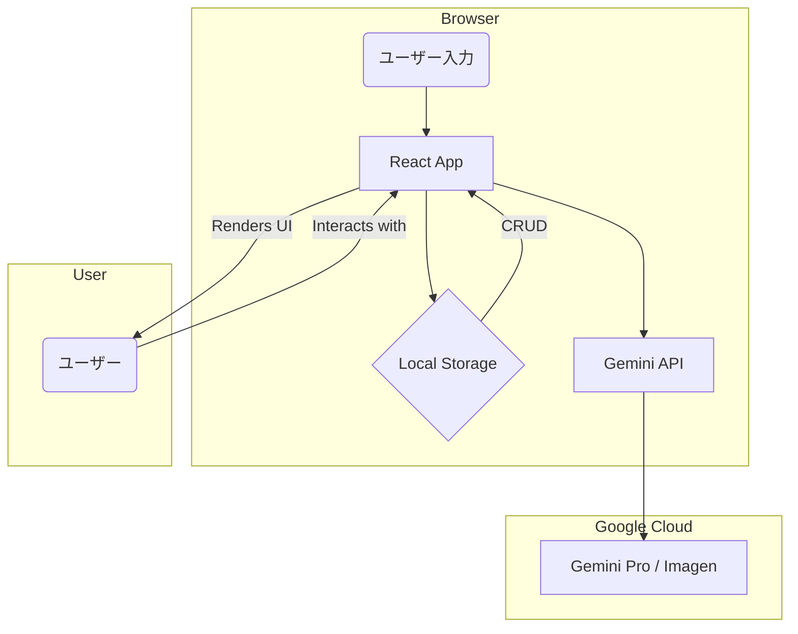
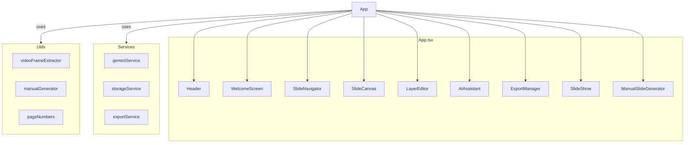
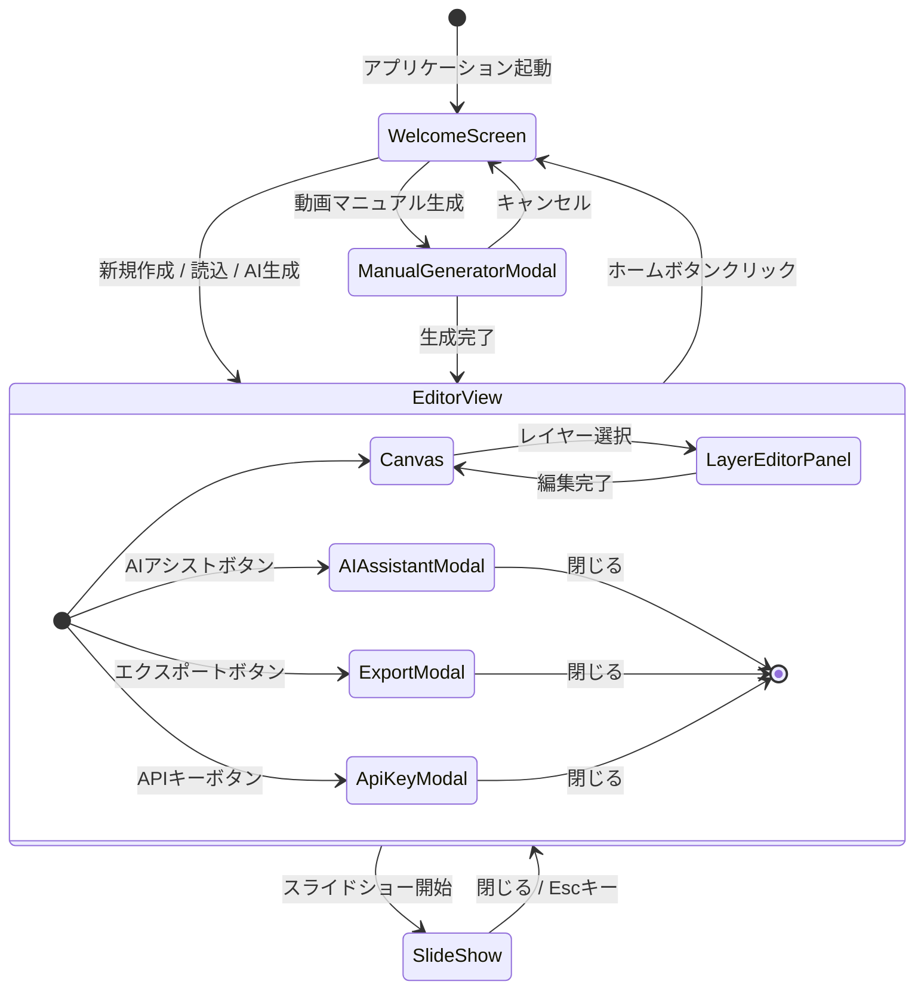
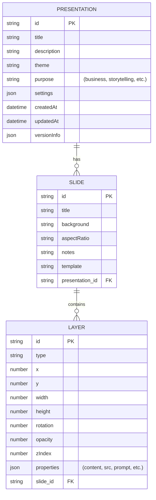

# 2. 基本設計書 - SlideMaster

## 2.1. 概要

本ドキュメントは、SlideMasterアプリケーションの基本的な設計について記述するものです。要件定義書に基づき、システム全体のアーキテクチャ、主要コンポーネント、画面構成、データモデルなどを定義します。

## 2.2. システムアーキテクチャ

SlideMasterは、クライアントサイドで完結するシングルページアプリケーション（SPA）として構築されます。サーバーサイドの処理は、Google Gemini APIとの連携を除き、原則として行いません。すべてのデータはユーザーのブラウザのローカルストレージに保存されます。

- **フロントエンド**: React (TypeScript) を使用し、Viteをビルドツールとして採用します。
- **状態管理**: Reactの `useState` と `useCallback` フックを主体としたコンポーネントベースの状態管理を行います。
- **データ永続化**: ブラウザの `localStorage` を使用して、プレゼンテーションデータや設定を保存します。
- **AI連携**: `@google/genai` ライブラリを介して、クライアントから直接Google Gemini APIを呼び出します。
- **動画処理**: 動画からのフレーム抽出は、ブラウザのCanvas APIとVideo要素を用いてクライアントサイドで実行します。

## 2.3. コンポーネント設計

アプリケーションは、責務に基づいて複数のReactコンポーネントに分割されます。

| コンポーネント名 | 責務 |
| :--- | :--- |
| `App.tsx` | アプリケーション全体の状態管理とコンポーネントの統括。 |
| `Header.tsx` | 保存、エクスポート、AIアシスタント起動などのグローバルな操作ボタンを提供。 |
| `WelcomeScreen.tsx` | アプリケーション起動時の初期画面。新規作成、読込、AI生成、**動画マニュアル生成**の起点。 |
| `ManualSlideGenerator.tsx` | **動画とMarkdownファイルからマニュアル形式のスライドを生成する機能のUIを提供。** |
| `SlideNavigator.tsx` | スライド一覧の表示と、スライドの選択・追加・削除・順序変更を管理。 |
| `SlideCanvas.tsx` | 現在選択されているスライドの表示と、レイヤーの直接操作（移動、リサイズなど）を提供。 |
| `LayerEditor.tsx` | 選択されたレイヤーの詳細なプロパティ（テキスト内容、色、フォントサイズなど）を編集。 |
| `AIAssistant.tsx` | AIによるスライド生成、**動画分析**、コンテンツ改善のインターフェースを提供。 |
| `ExportManager.tsx` | プレゼンテーションのエクスポート形式やオプションを設定するインターフェース。 |
| `SlideShow.tsx` | プレゼンテーションを再生するモード。 |
| `ApiKeyManager.tsx` | ユーザーがGemini APIキーを設定・管理するインターフェース。 |

## 2.4. 画面遷移図

## 2.5. データモデル設計（ER図）

アプリケーションで扱う主要なデータ構造を定義します。

- **Presentation**: プレゼンテーション全体を表すオブジェクト。複数の`Slide`を持つ。**`purpose`** プロパティを追加し、プレゼンテーションの用途（ビジネス、教育、物語など）を保持する。
- **Slide**: 個々のスライドを表すオブジェクト。複数の`Layer`を持つ。
- **Layer**: スライド内の要素（テキスト、画像、図形）を表すオブジェクト。`type`プロパティによって具体的な型（`TextLayer`, `ImageLayer`, `ShapeLayer`）が決まる。`ImageLayer`にはAI生成のための`prompt`や`seed`が含まれる。

詳細は `types.ts` を参照。

## 2.6. 外部サービス連携

- **Google Gemini API**:
    - **目的**: テキスト生成（スライド構成、コンテンツ、**動画分析によるマニュアル原稿作成**）、画像生成。
    - **連携方法**: `@google/genai` SDKを使用し、クライアントから直接APIを呼び出す。
    - **認証**: ユーザーが設定したAPIキー、または環境変数に設定されたデフォルトのAPIキーを使用する。
    - **モデル**: 用途に応じて `Gemini Pro`, `Gemini Flash`, `Imagen` などを使い分ける。

---
