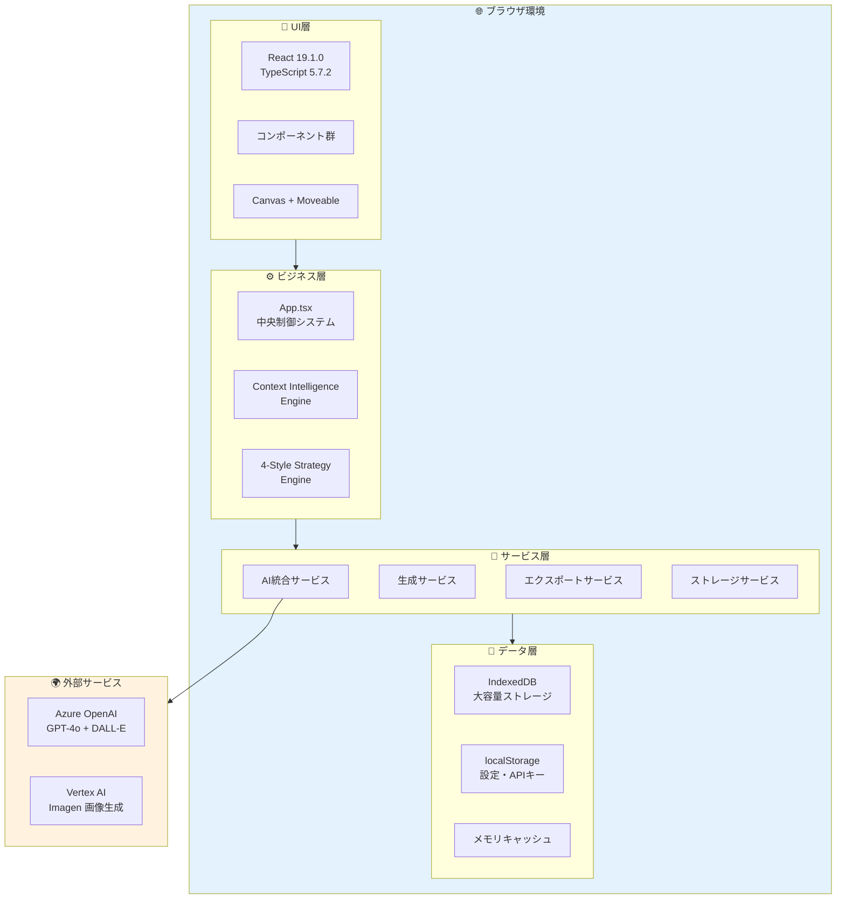
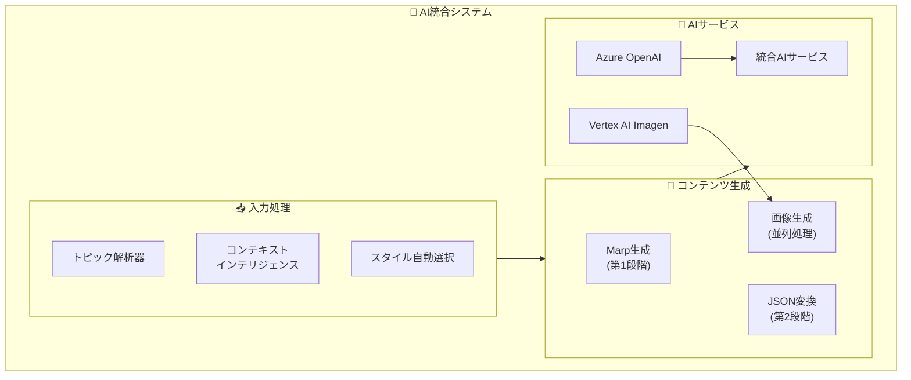
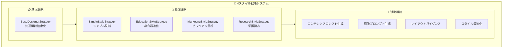
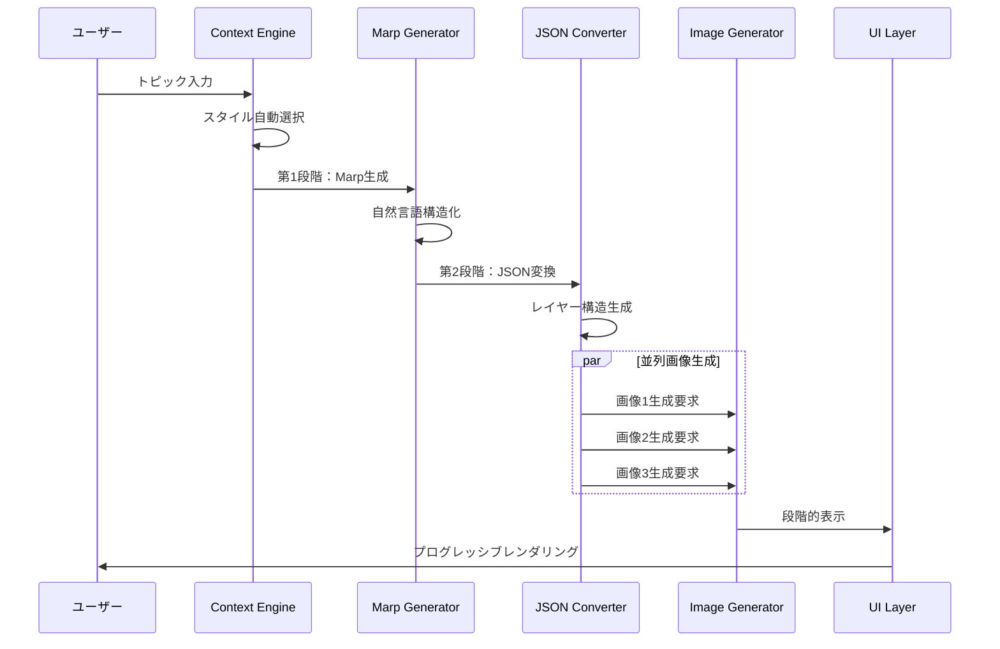
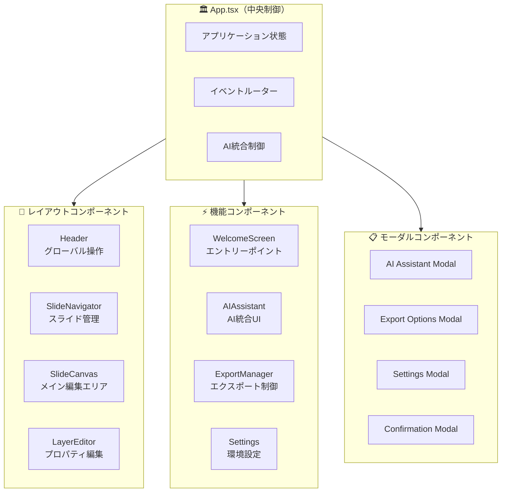
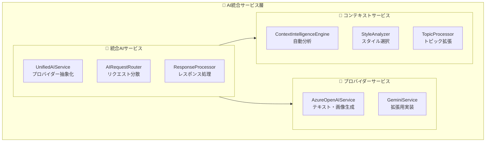
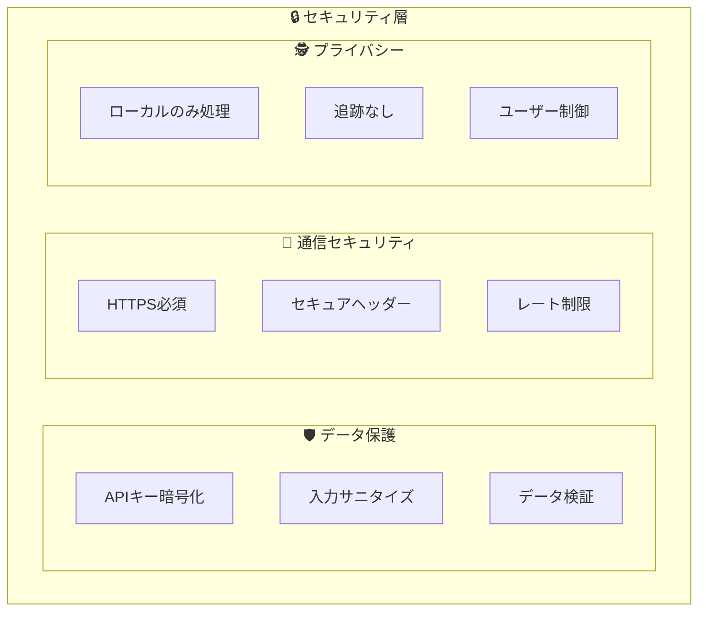
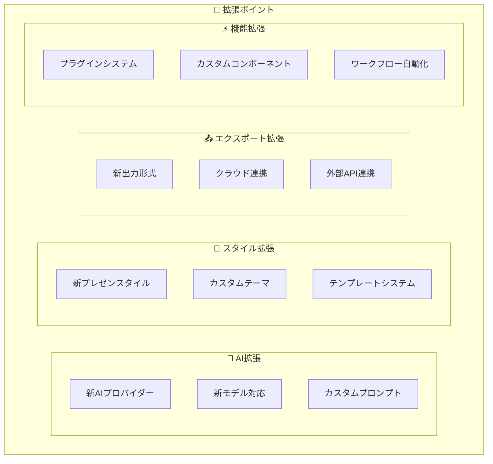

# SlideMaster - 基本設計書 v2.0

**文書バージョン**: 2.0  
**最終更新日**: 2025年8月13日  
**対象システム**: SlideMaster AI-Powered Presentation Generator  

---

## 1. システムアーキテクチャ概要

### 1.1 設計の核心思想

**SlideMaster**は、AI統合を軸とした革新的なプレゼンテーション生成プラットフォームとして、以下の設計思想に基づいて構築されています：

- **AI First Architecture**: Azure OpenAI統合を中心とした自動生成システム
- **4-Style Strategy Pattern**: 用途別最適化による高品質プレゼンテーション
- **Marp→JSON 2-Phase Approach**: トークン効率性と表現力の両立
- **Progressive Rendering**: ユーザー体験向上のための段階的表示
- **Client-Side Complete**: セキュリティとプライバシーを重視した完全クライアント実装

### 1.2 全体アーキテクチャ



### 1.3 技術スタック

#### **フロントエンド基盤**
- **React 19.1.0**: 最新のConcurrent Features活用
- **TypeScript 5.7.2**: 厳密な型システム
- **Vite 6.2.0**: 高速ビルドシステム
- **ESLint + Prettier**: コード品質管理

#### **UI・UX技術**
- **Tailwind CSS**: ユーティリティファーストCSS
- **Lucide React**: モダンアイコンライブラリ
- **react-moveable**: 高度なレイヤー操作
- **React Hot Toast**: 通知システム

#### **データ管理**
- **Dexie.js**: IndexedDBラッパー
- **localStorage**: 軽量設定保存
- **メモリキャッシュ**: パフォーマンス最適化

#### **エクスポート・統合**
- **PptxGenJS**: PowerPoint生成
- **jsPDF**: PDF生成
- **html-to-image**: 画像変換
- **file-saver**: ファイルダウンロード

---

## 2. コアシステム設計

### 2.1 AI統合アーキテクチャ



### 2.2 4スタイル戦略システム



#### **スタイル別特性**

| スタイル | 適用場面 | ビジュアル特性 | 技術的実装 |
|---------|----------|---------------|------------|
| **Simple** | ビジネス・学術・技術 | クリーンデザイン、データ可視化 | 構造化レイアウト、論理階層 |
| **Education** | 教育・研修・ストーリー | 大きな文字、親しみやすい色彩 | 視認性重視、イラスト中心 |
| **Marketing** | 商品紹介・営業・ブランディング | ビジュアルインパクト、魅力的配色 | 画像主体、感情訴求 |
| **Research** | 研究発表・学会・分析報告 | 論理的構成、インフォグラフィック | フレームワーク対応、構造図 |

### 2.3 Marp→JSON二段階生成



---

## 3. データモデル設計

### 3.1 中核データ構造

```typescript
// プレゼンテーションデータモデル
interface Presentation {
  id: string;
  title: string;
  description: string;
  createdAt: Date;
  updatedAt: Date;
  version: string;
  
  // メタデータ
  metadata: {
    totalSlides: number;
    estimatedDuration: number;
    tags: string[];
    author: string;
    lastModified: Date;
  };
  
  // スライド配列
  slides: Slide[];
  
  // 全体設定
  settings: {
    theme: string;
    aspectRatio: AspectRatio;
    defaultFont: string;
    colorScheme: ColorScheme;
    pageNumbering: PageNumberSettings;
  };
  
  // AI生成履歴
  aiHistory: AIInteractionRecord[];
}

// スライドデータモデル
interface Slide {
  id: string;
  title: string;
  layers: Layer[];
  background: string;
  aspectRatio: AspectRatio;
  template: SlideTemplate;
  speakerNotes?: string;
  
  // レイアウト情報
  layout: {
    type: LayoutType;
    grid: GridSettings;
    alignment: AlignmentSettings;
  };
}

// レイヤーデータモデル
interface Layer {
  id: string;
  type: LayerType;
  
  // 位置・サイズ（パーセンテージ座標系）
  x: number;        // 0-100%
  y: number;        // 0-100%
  width: number;    // 0-100%
  height: number;   // 0-100%
  
  // 描画属性
  zIndex: number;
  rotation: number;
  opacity: number;
  visible: boolean;
  
  // コンテンツ・スタイル
  content: LayerContent;
  style: LayerStyle;
  
  // メタデータ
  metadata: {
    createdAt: Date;
    modifiedAt: Date;
    source: 'user' | 'ai' | 'import';
  };
}
```

### 3.2 アプリケーション状態管理

```typescript
interface AppState {
  // 現在の作業状態
  currentPresentation: Presentation | null;
  currentSlideIndex: number;
  selectedLayerIds: string[];
  
  // キャンバス状態
  canvasState: {
    zoom: number;
    panX: number;
    panY: number;
    gridVisible: boolean;
    gridSnap: boolean;
    tool: CanvasTool;
  };
  
  // AI処理状態
  aiState: {
    isProcessing: boolean;
    currentOperation: AIOperation | null;
    progress: ProgressState;
    history: AIInteractionRecord[];
  };
  
  // UI状態
  uiState: {
    activeModal: ModalType | null;
    sidebarCollapsed: boolean;
    layerPanelExpanded: boolean;
    notifications: NotificationItem[];
  };
  
  // アプリケーション設定
  appSettings: {
    autoSave: boolean;
    autoSaveInterval: number;
    defaultExportFormat: ExportFormat;
    apiKeys: EncryptedAPIKeys;
    theme: UITheme;
  };
  
  // 操作履歴（Undo/Redo）
  history: {
    undoStack: HistoryAction[];
    redoStack: HistoryAction[];
    maxHistorySize: number;
  };
}
```

---

## 4. コンポーネント設計

### 4.1 コンポーネント階層



### 4.2 主要コンポーネント設計

#### **App.tsx - 中央制御システム**
```typescript
interface AppComponent {
  // 状態管理
  state: AppState;
  
  // AI統合制御
  aiController: {
    generateSlides: (topic: string, options: GenerationOptions) => Promise<Presentation>;
    generateImage: (prompt: string, style: ImageStyle) => Promise<string>;
    analyzeContent: (content: string) => Promise<ContentAnalysis>;
  };
  
  // イベントハンドリング
  eventHandlers: {
    onSlideChange: (index: number) => void;
    onLayerSelect: (layerId: string) => void;
    onLayerUpdate: (layerId: string, updates: Partial<Layer>) => void;
    onStyleChange: (style: PresentationStyle) => void;
  };
  
  // ライフサイクル管理
  lifecycle: {
    onMount: () => void;
    onUnmount: () => void;
    onSave: () => Promise<void>;
    onLoad: (presentation: Presentation) => void;
  };
}
```

#### **SlideCanvas - メイン編集エリア**
```typescript
interface SlideCanvasComponent {
  // レイヤー管理
  layerManager: {
    addLayer: (type: LayerType, position: Point) => void;
    removeLayer: (layerId: string) => void;
    updateLayer: (layerId: string, updates: Partial<Layer>) => void;
    reorderLayers: (layerIds: string[]) => void;
  };
  
  // 操作制御
  operationManager: {
    handleDrag: (layerId: string, delta: Point) => void;
    handleResize: (layerId: string, bounds: Bounds) => void;
    handleRotate: (layerId: string, angle: number) => void;
    handleSelect: (layerIds: string[]) => void;
  };
  
  // レンダリング最適化
  renderOptimization: {
    virtualScrolling: boolean;
    layerCaching: boolean;
    webglAcceleration: boolean;
  };
}
```

---

## 5. サービス層設計

### 5.1 AI統合サービス



### 5.2 コンテンツ生成サービス

```typescript
interface ContentGenerationServices {
  // Marpコンテンツサービス
  marpContentService: {
    generateTitle: (options: TitleOptions) => Promise<string>;
    generateMarpContent: (topic: string, options: MarpOptions) => Promise<MarpPresentation>;
    parseMarpResponse: (marpText: string) => MarpPresentation;
  };
  
  // レイアウトサービス
  marpLayoutService: {
    convertToJSON: (marpSlide: MarpSlide, options: LayoutOptions) => Promise<JSONSlide>;
    validateJSON: (jsonContent: string) => boolean;
    repairJSON: (incompleteJSON: string) => string;
  };
  
  // 画像生成サービス
  imageGenerationService: {
    generateSlideImage: (prompt: string, options: ImageOptions) => Promise<string>;
    enhancePrompt: (basePrompt: string, style: ImageStyle) => string;
    validateImageQuality: (imageUrl: string) => Promise<QualityMetrics>;
  };
  
  // スライド生成ファクトリ
  slideGenerationFactory: {
    createStrategy: (style: PresentationStyle) => DesignerStrategy;
    generateSlides: (request: SlideRequest) => Promise<Presentation>;
    enhanceContent: (slides: Slide[], enhancements: Enhancement[]) => Promise<Slide[]>;
  };
}
```

### 5.3 エクスポートサービス

```mermaid
graph TD
    subgraph Export_Services["📤 エクスポートサービス層"]
        subgraph Core_Export["🎯 コアエクスポート"]
            ExportManager["ExportManager<br/>統合制御"]
            QualityController["QualityController<br/>品質管理"]
            BatchProcessor["BatchProcessor<br/>一括処理"]
        end
        
        subgraph Format_Services["📋 形式別サービス"]
            PDFService["PDFExportService"]
            PPTXService["PPTXExportService"]
            ImageService["ImageExportService"]
            HTMLService["HTMLExportService"]
            MarpService["MarpExportService"]
            SVGService["SVGExportService"]
            ZIPService["ZIPExportService"]
        end
        
        subgraph Optimization["⚡ 最適化"]
            Compression["圧縮最適化"]
            Resolution["解像度調整"]
            Metadata["メタデータ管理"]
        end
    end
    
    Core_Export --> Format_Services
    Format_Services --> Optimization
```



---

## 6. パフォーマンス最適化設計

### 6.1 レンダリング最適化

```typescript
interface PerformanceOptimizations {
  // React最適化
  reactOptimizations: {
    useMemo: "重いコンポーネント計算のメモ化";
    useCallback: "イベントハンドラーの最適化";
    useTransition: "非同期更新の優先度制御";
    useDeferredValue: "重い更新の遅延実行";
  };
  
  // レンダリング最適化
  renderingOptimizations: {
    virtualScrolling: "大量スライドの仮想化表示";
    layerCaching: "レイヤー描画のキャッシュ化";
    webglAcceleration: "WebGLによるGPU活用";
    canvasOptimization: "Canvas描画の最適化";
  };
  
  // メモリ管理
  memoryManagement: {
    objectPooling: "オブジェクトの再利用";
    weakReferences: "メモリリーク防止";
    lazyLoading: "必要時読み込み";
    imageOptimization: "画像サイズ最適化";
  };
  
  // ネットワーク最適化
  networkOptimizations: {
    parallelRequests: "並列AI リクエスト";
    requestBatching: "リクエストのバッチ化";
    responseCompression: "レスポンス圧縮";
    smartCaching: "インテリジェントキャッシュ";
  };
}
```

### 6.2 パフォーマンス指標

```typescript
interface PerformanceTargets {
  // Core Web Vitals
  coreWebVitals: {
    firstContentfulPaint: "< 1.2s";
    largestContentfulPaint: "< 2.5s";
    firstInputDelay: "< 100ms";
    cumulativeLayoutShift: "< 0.1";
  };
  
  // アプリケーション固有
  applicationMetrics: {
    slideRenderTime: "< 16ms (60fps)";
    layerManipulation: "< 8ms (120fps)";
    aiGenerationTime: "< 180s (8 slides)";
    exportSpeed: "> 5 slides/minute";
    memoryUsage: "< 1GB (50 slides)";
  };
  
  // ユーザー体験
  userExperience: {
    appStartup: "< 3s";
    slideTransition: "< 200ms";
    undoRedoResponse: "< 50ms";
    autoSaveTime: "< 2s";
    errorRecovery: "< 1s";
  };
}
```

---

## 7. セキュリティ・プライバシー設計

### 7.1 セキュリティアーキテクチャ



### 7.2 セキュリティ実装

```typescript
interface SecurityImplementations {
  // データ暗号化
  dataEncryption: {
    apiKeyEncryption: "ブラウザ標準暗号化API使用";
    localStorageEncryption: "AES-256による暗号化";
    memoryProtection: "センシティブデータのメモリ保護";
  };
  
  // 入力検証
  inputValidation: {
    xssProtection: "HTMLエンティティエンコーディング";
    sqlInjectionPrevention: "パラメータ化クエリ（該当なし）";
    fileUploadValidation: "ファイル形式・サイズ検証";
    promptSanitization: "AIプロンプトのサニタイズ";
  };
  
  // 通信セキュリティ
  communicationSecurity: {
    httpsOnly: "HTTP通信の完全禁止";
    apiKeyHeaders: "Authorization ヘッダー使用";
    certificatePinning: "証明書ピンニング";
    timeoutSettings: "適切なタイムアウト設定";
  };
  
  // プライバシー保護
  privacyProtection: {
    dataResidency: "データのローカル保存のみ";
    anonymization: "個人情報の匿名化";
    consentManagement: "ユーザー同意管理";
    dataMinimization: "最小限データ使用";
  };
}
```

---

## 8. 運用・保守設計

### 8.1 エラーハンドリング

```typescript
interface ErrorHandlingStrategy {
  // AI API エラー
  aiApiErrors: {
    networkErrors: "3回リトライ（指数バックオフ）";
    rateLimitErrors: "自動待機・再試行";
    invalidResponses: "JSON修復・フォールバック";
    authenticationErrors: "ユーザー通知・再設定誘導";
  };
  
  // アプリケーションエラー
  applicationErrors: {
    componentErrors: "Error Boundary でキャッチ";
    stateErrors: "状態リセット・自動復旧";
    storageErrors: "代替ストレージ・データ復旧";
    renderingErrors: "フォールバック UI表示";
  };
  
  // ユーザー体験
  userExperience: {
    gracefulDegradation: "機能縮退での継続動作";
    errorReporting: "詳細エラー情報の提供";
    recoveryGuidance: "復旧手順のガイダンス";
    dataProtection: "作業中データの保護";
  };
}
```

### 8.2 パフォーマンス監視

```typescript
interface PerformanceMonitoring {
  // メトリクス収集
  metricsCollection: {
    renderingPerformance: "フレームレート・描画時間";
    memoryUsage: "メモリ使用量・リーク検出";
    networkPerformance: "API応答時間・エラー率";
    userInteractions: "操作応答時間・成功率";
  };
  
  // アラート設定
  alertSettings: {
    performanceThresholds: "性能閾値の監視";
    errorRateThresholds: "エラー率の監視";
    memoryLeakDetection: "メモリリークの検出";
    networkFailures: "ネットワーク障害の検出";
  };
  
  // 最適化提案
  optimizationSuggestions: {
    automaticTuning: "自動パフォーマンス調整";
    resourceOptimization: "リソース使用最適化";
    cacheOptimization: "キャッシュ戦略最適化";
    userGuidance: "ユーザー向け最適化ガイド";
  };
}
```

---

## 9. 拡張性・将来性設計

### 9.1 拡張ポイント



### 9.2 アーキテクチャの柔軟性

```typescript
interface ArchitectureFlexibility {
  // プラグインアーキテクチャ
  pluginArchitecture: {
    pluginLoader: "動的プラグイン読み込み";
    apiStandardization: "標準化されたプラグインAPI";
    sandboxExecution: "セキュアなプラグイン実行";
    dependencyManagement: "依存関係管理";
  };
  
  // モジュラー設計
  modularDesign: {
    serviceAbstraction: "サービス層の抽象化";
    componentIsolation: "コンポーネントの独立性";
    configurationDriven: "設定駆動開発";
    featureToggling: "機能フラグ管理";
  };
  
  // 国際化対応
  internationalization: {
    multiLanguage: "多言語UI対応";
    localizedContent: "ローカライズコンテンツ";
    culturalAdaptation: "文化的適応";
    rtlSupport: "RTL言語対応";
  };
  
  // スケーラビリティ
  scalability: {
    horizontalScaling: "水平スケーリング準備";
    loadDistribution: "負荷分散対応";
    dataPartitioning: "データ分散";
    performanceOptimization: "性能最適化フレームワーク";
  };
}
```

---

**この基本設計書により、SlideMasterの技術的詳細と設計思想を包括的に把握できます。現在の実装状況を正確に反映し、将来の拡張性も考慮した設計となっています。**