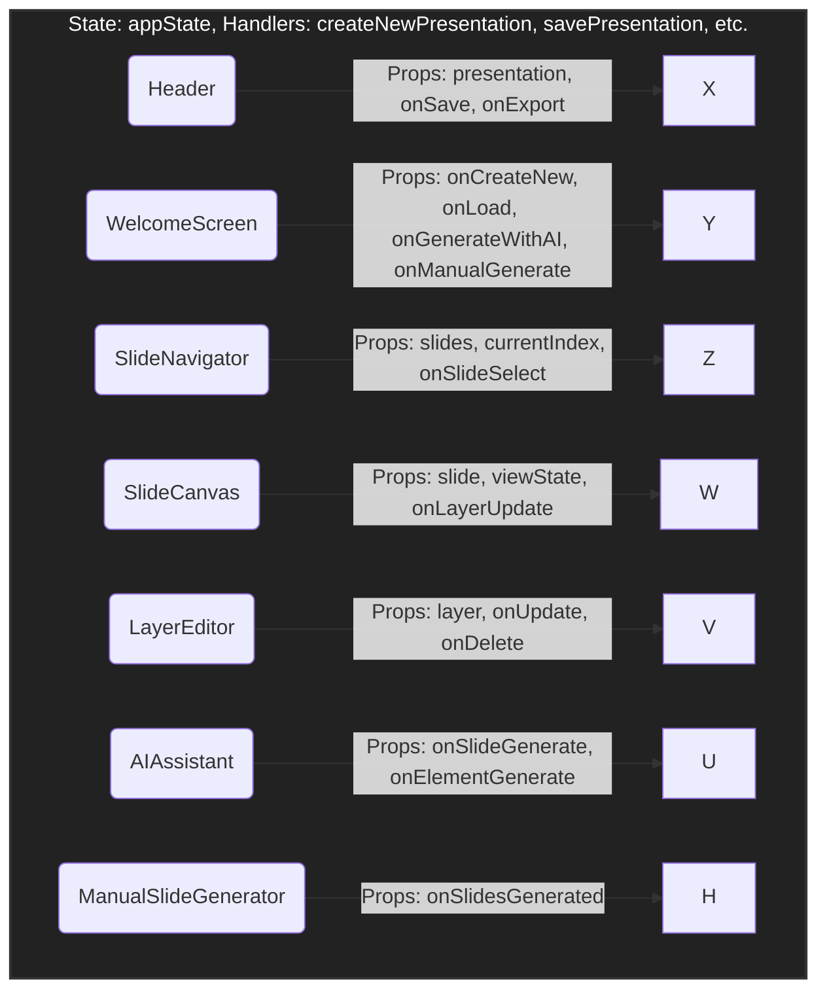
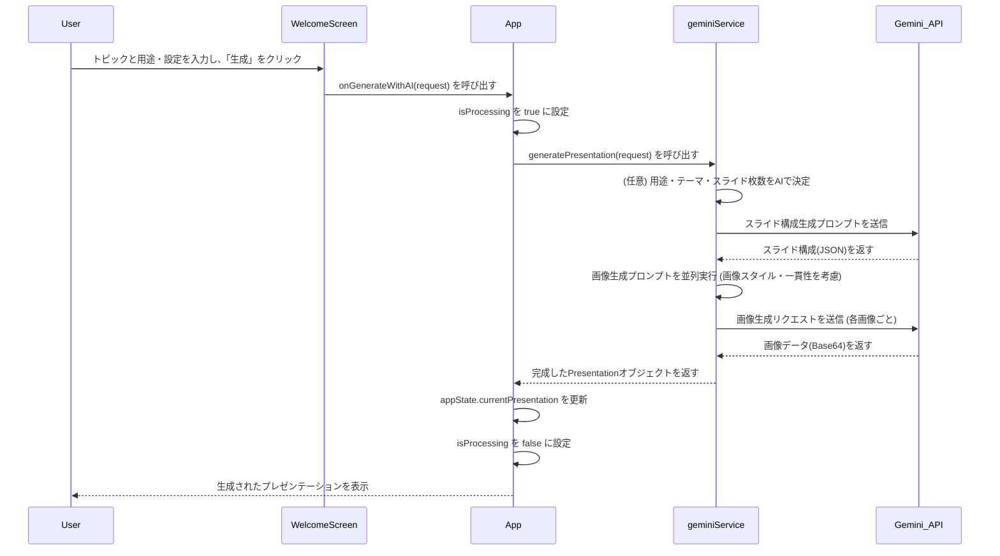
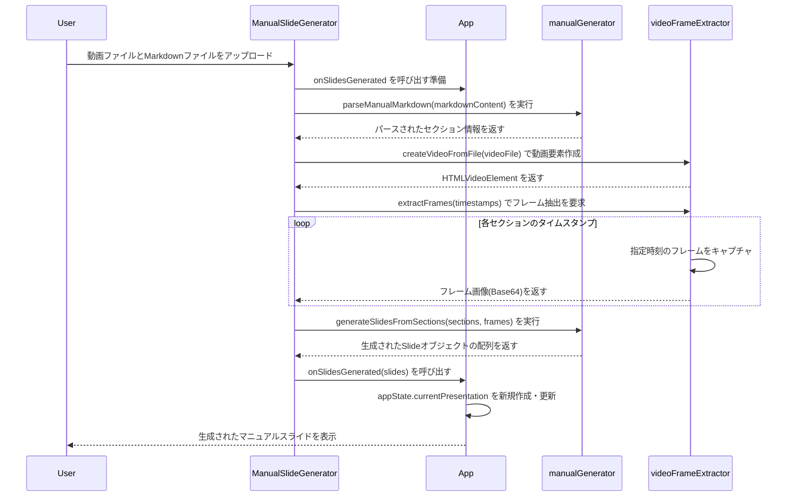

# 3. 詳細設計書 - SlideMaster

## 3.1. 概要

本ドキュメントは、SlideMasterの内部実装に関する詳細な設計を記述するものです。基本設計書で定義されたコンポーネントやデータモデルに基づき、具体的な処理フロー、状態管理、関数仕様などを明確にします。

## 3.2. コンポーネント詳細設計

### 3.2.1. コンポーネントツリーとPropsの伝達

主要なコンポーネント間の親子関係と、状態（state）およびコールバック関数（props）の伝達経路を図示します。



- **`App.tsx`**: アプリケーションの最上位コンポーネントとして、`appState`（プレゼンテーションデータ、現在のスライドインデックス、キャンバス状態などを含む）を一元管理します。
- **状態更新ロジック**: `App.tsx`内に定義された各種ハンドラ（`addSlide`, `updateLayer`など）が `setAppState` を呼び出すことで、状態を一方向に更新します。これにより、状態の変更が予測可能になります。
- **Propsによる伝達**:
    - 子コンポーネントは、表示に必要なデータ（例: `SlideNavigator` に `slides`）をPropsとして受け取ります。
    - ユーザー操作によって状態の変更が必要な場合、子コンポーネントはPropsとして渡されたコールバック関数（例: `WelcomeScreen` の `onManualGenerate`）を呼び出します。

### 3.2.2. 状態管理 (`AppState`)

アプリケーションの中心となる `appState` の構造は以下の通りです。

```typescript
interface AppState {
  currentPresentation: Presentation | null; // 現在のプレゼンテーションデータ
  currentSlideIndex: number; // 表示・編集中のスライドのインデックス
  canvasState: CanvasState; // キャンバスの状態 (ズーム、オフセット、選択レイヤーIDなど)
  isLoading: boolean; // AI処理中などのローディング状態
  error: string | null; // エラーメッセージ
  recentPresentations: Presentation[]; // 最近開いたプレゼンテーションのリスト
  appSettings: AppSettings; // アプリケーション全体の設定
}

interface Presentation {
  // ... (他のプロパティ)
  purpose?: PresentationPurpose; // AI生成の目的
  imageGenerationSettings?: ImageGenerationSettings; // 画像生成設定
}
```

## 3.3. 主要機能の処理フロー

### 3.3.1. AIによるプレゼンテーション生成フロー



1.  **ユーザー入力**: `WelcomeScreen`でトピック、用途、テーマ、画像生成の詳細設定などを入力します。
2.  **リクエスト開始**: `App.tsx`の`generateSlides`関数が呼び出されます。
3.  **AIへのリクエスト**: `geminiService.ts`の`generatePresentation`関数が、まず用途やテーマ、最適なスライド枚数をAIに問い合わせ（'auto'の場合）、その後スライドの構成（タイトル、テキスト、画像プロンプト）をAIに問い合わせます。
4.  **画像生成**: 返された構成に基づき、`geminiService.ts`の`generateImage`関数が各スライドの画像を並列で生成します。この際、ユーザーが指定した画像スタイルや一貫性の設定がプロンプトに反映されます。
5.  **データ構築**: 全ての情報（テキスト、生成された画像データなど）を統合し、`Presentation`オブジェクトを構築します。
6.  **状態更新**: `App.tsx`が受け取った`Presentation`オブジェクトで`appState`を更新し、UIに反映させます。

### 3.3.2. 動画からのマニュアル生成フロー



1.  **ユーザー入力**: `ManualSlideGenerator`コンポーネントで、操作動画とタイムスタンプ付きのMarkdownファイルをアップロードします。
2.  **Markdown解析**: `manualGenerator.ts`の`parseManualMarkdown`が呼ばれ、Markdownがセクション（タイトル、タイムスタンプ、説明文）ごとに分割されます。
3.  **動画準備**: `videoFrameExtractor.ts`の`createVideoFromFile`が呼ばれ、動画ファイルを扱えるHTMLVideoElementを生成します。
4.  **フレーム抽出**: 解析された各セクションのタイムスタンプに基づき、`videoFrameExtractor`が動画の該当箇所からフレーム画像を非同期で抽出します。
5.  **スライド構築**: `manualGenerator.ts`の`generateSlidesFromSections`が、解析されたセクション情報と抽出されたフレーム画像を基に、`Slide`オブジェクトの配列を生成します。レイアウト（画像の配置など）はオプションで指定可能です。
6.  **状態更新**: `App.tsx`が`onSlidesGenerated`経由で`Slide`配列を受け取り、新しいプレゼンテーションとして`appState`を更新し、UIに反映させます。

### 3.3.3. レイヤー編集フロー

（変更なし）

### 3.3.4. エクスポート処理フロー (PDFの場合)

（変更なし）

---
