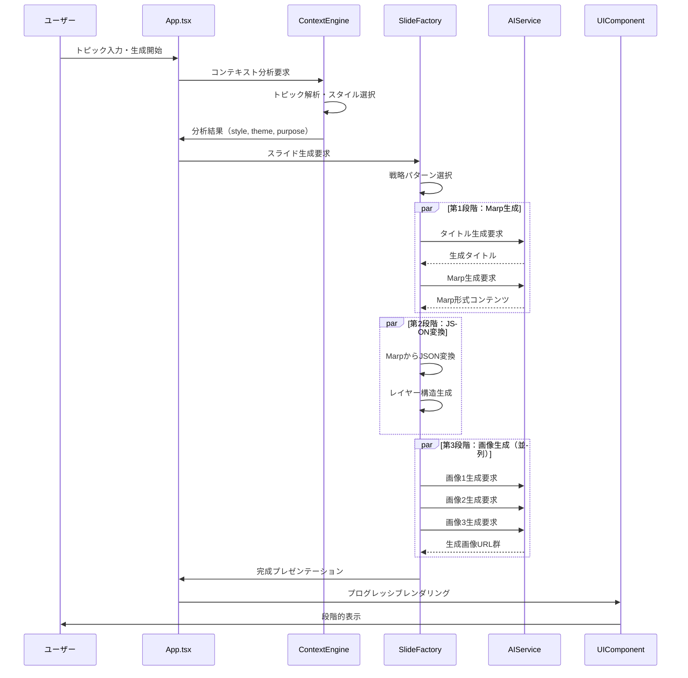

# SlideMaster - 詳細設計書 v2.0

**文書バージョン**: 2.0  
**最終更新日**: 2025年8月13日  
**対象システム**: SlideMaster AI-Powered Presentation Generator  

---

## 1. 詳細アーキテクチャ実装

### 1.1 中央制御システム：App.tsx

App.tsxは本システムの心臓部として、全ての状態管理とイベント制御を担当します。

```typescript
// App.tsx - 中央制御システムの詳細実装
interface AppImplementation {
  // アプリケーション状態（React useState）
  state: {
    currentPresentation: Presentation | null;
    currentSlideIndex: number;
    selectedLayerIds: string[];
    canvasState: CanvasState;
    isAIProcessing: boolean;
    activeModal: ModalType | null;
    notifications: NotificationItem[];
    recentPresentations: Presentation[];
    appSettings: AppSettings;
  };
  
  // 200+ イベントハンドラー
  eventHandlers: {
    // プレゼンテーション操作
    onCreateNewPresentation: () => void;
    onLoadPresentation: (presentation: Presentation) => void;
    onSavePresentation: () => Promise<void>;
    onExportPresentation: (format: ExportFormat) => Promise<void>;
    
    // スライド操作
    onAddSlide: (index?: number) => void;
    onDeleteSlide: (index: number) => void;
    onDuplicateSlide: (index: number) => void;
    onMoveSlide: (fromIndex: number, toIndex: number) => void;
    onSelectSlide: (index: number) => void;
    
    // レイヤー操作
    onAddLayer: (type: LayerType, properties: LayerProperties) => void;
    onUpdateLayer: (layerId: string, updates: Partial<Layer>) => void;
    onDeleteLayer: (layerId: string) => void;
    onSelectLayer: (layerId: string, multiSelect?: boolean) => void;
    onMoveLayer: (layerId: string, newPosition: Point) => void;
    onResizeLayer: (layerId: string, newBounds: Bounds) => void;
    
    // AI統合操作
    onGenerateWithAI: (topic: string, options: GenerationOptions) => Promise<void>;
    onGenerateImage: (prompt: string, style: ImageStyle) => Promise<string>;
    onImproveContent: (content: string, type: ImprovementType) => Promise<string>;
    
    // UI操作
    onOpenModal: (modalType: ModalType, options?: ModalOptions) => void;
    onCloseModal: () => void;
    onShowNotification: (notification: NotificationItem) => void;
    onUpdateCanvasState: (updates: Partial<CanvasState>) => void;
  };
  
  // ライフサイクル管理
  lifecycle: {
    onMount: () => void;        // アプリ初期化
    onUnmount: () => void;      // クリーンアップ
    onAutoSave: () => void;     // 自動保存
    onWindowResize: () => void; // リサイズ対応
  };
}
```

### 1.2 AI統合システム詳細実装



---

## 2. コアサービス実装詳細

### 2.1 Context Intelligence Engine

```typescript
// Context Intelligence Engine - 自動分析システム
class ContextIntelligenceEngine {
  // トピック分析
  async analyzeTopicContext(topic: string): Promise<ContextAnalysis> {
    const expandedTopic = await this.expandTopic(topic);
    const styleAnalysis = await this.analyzeStyle(expandedTopic);
    
    return {
      originalTopic: topic,
      expandedContent: expandedTopic,
      selectedStyle: styleAnalysis.selectedStyle,
      confidence: styleAnalysis.confidence,
      reasoning: styleAnalysis.reason,
      suggestedSettings: {
        slideCount: this.estimateSlideCount(expandedTopic),
        imageConsistency: this.determineImageConsistency(styleAnalysis.selectedStyle),
        pageNumbers: this.shouldIncludePageNumbers(styleAnalysis.selectedStyle)
      }
    };
  }
  
  // トピック拡張
  private async expandTopic(topic: string): Promise<string> {
    // 短いトピックを展開し、生成に適した内容に変換
    if (this.isMinimalTopic(topic)) {
      const expandPrompt = contextIntelligenceResources.topicProcessing.expansionPrompt
        .replace('{topic}', topic);
      
      return await this.aiService.generateText(expandPrompt);
    }
    return topic;
  }
  
  // スタイル自動選択
  private async analyzeStyle(content: string): Promise<StyleAnalysis> {
    const analysisPrompt = contextIntelligenceResources.simplifiedAnalysis.systemPrompt
      .replace('{topic}', content);
    
    const response = await this.aiService.generateText(analysisPrompt);
    return this.parseStyleAnalysis(response);
  }
  
  // 最小トピック判定
  private isMinimalTopic(topic: string): boolean {
    const wordCount = topic.split(/\s+/).length;
    const lineCount = topic.split('\n').length;
    const sentenceCount = topic.split(/[.!?。！？]/).length - 1;
    
    return wordCount <= 15 && lineCount <= 2 && sentenceCount <= 1;
  }
}
```

### 2.2 4スタイル戦略システム実装

```typescript
// 基本戦略クラス - 共通機能の抽象化
abstract class BaseDesignerStrategy {
  abstract readonly designerId: string;
  abstract readonly designerName: string;
  
  // コンテンツ生成プロンプト構築
  abstract buildContentPrompt(request: EnhancedSlideRequest): string;
  
  // 画像生成プロンプト構築
  abstract buildImagePrompt(slideContent: string, imageContext: any): string;
  
  // レイアウト戦略取得
  abstract getLayoutStrategy(): LayoutStrategy;
  
  // 共通処理：Marp→JSON二段階生成
  async generateSlides(request: EnhancedSlideRequest): Promise<Presentation> {
    // 第1段階：タイトル生成
    const titlePrompt = this.buildTitlePrompt(request);
    const generatedTitle = await this.aiService.generateText(titlePrompt);
    
    // 第2段階：Marp生成
    const marpPrompt = this.buildMarpPrompt(request, generatedTitle);
    const marpContent = await this.aiService.generateText(marpPrompt);
    const parsedMarp = this.marpService.parseMarpResponse(marpContent);
    
    // 第3段階：JSON変換（スライド毎）
    const jsonSlides: Slide[] = [];
    for (const marpSlide of parsedMarp.slides) {
      const jsonSlide = await this.convertMarpToJSON(marpSlide, request);
      jsonSlides.push(jsonSlide);
    }
    
    // 第4段階：画像生成（並列）
    const enhancedSlides = await this.enhanceWithImages(jsonSlides, request);
    
    return this.buildPresentation(enhancedSlides, parsedMarp, request);
  }
  
  // スライド個別JSON変換
  private async convertMarpToJSON(marpSlide: MarpSlide, request: EnhancedSlideRequest): Promise<Slide> {
    const layoutPrompt = this.buildLayoutPrompt(marpSlide, request);
    const jsonResponse = await this.aiService.generateText(layoutPrompt);
    
    // JSON修復・検証
    const validatedJSON = this.validateAndRepairJSON(jsonResponse);
    return this.parseSlideJSON(validatedJSON);
  }
}

// Education Style 戦略実装
class EducationStyleStrategy extends BaseDesignerStrategy {
  readonly designerId = 'education' as const;
  readonly designerName = 'Education Style';
  
  buildContentPrompt(request: EnhancedSlideRequest): string {
    const template = contextIntelligenceResources.styleStrategies.education.contentPrompt;
    
    return template
      .replace(/{topic}/g, request.topic)
      .replace(/{slideCountInstructions}/g, this.getSlideCountInstructions(request.slideCount))
      .replace(/{imageInstructions}/g, this.getImageInstructions(request))
      .replace(/{jsonStructureInstructions}/g, this.getJsonStructureInstructions());
  }
  
  buildImagePrompt(slideContent: string, imageContext: any): string {
    // 個別スライド内容を使用（全体トピックではなく）
    const specificContent = slideContent;
    const consistencyLevel = imageContext?.imageConsistencyLevel || 'medium';
    
    const stylePrompt = contextIntelligenceResources.styleStrategies.education.imagePrompt
      .replace(/{topic}/g, specificContent);
    
    const consistencyInstruction = this.getConsistencyInstruction(consistencyLevel);
    
    return `${stylePrompt}

${consistencyInstruction}

Create an engaging, educational image that accurately represents the specific slide content while applying only the specified visual touch style.`;
  }
  
  getLayoutStrategy(): LayoutStrategy {
    return {
      preferredLayouts: ['education-friendly', 'step-by-step', 'large-text'],
      imagePositioning: 'dominant' as const,
      textDensity: 'minimal' as const
    };
  }
  
  private getConsistencyInstruction(level: 'high' | 'medium' | 'low'): string {
    switch (level) {
      case 'high':
        return 'CONSISTENCY REQUIREMENT: Use the same illustration style, character design, color scheme throughout.';
      case 'medium':
        return 'CONSISTENCY REQUIREMENT: Maintain similar educational art style and color harmony.';
      case 'low':
        return 'CONSISTENCY REQUIREMENT: Focus on educational effectiveness over visual consistency.';
      default:
        return '';
    }
  }
}
```

### 2.3 Marp→JSON変換システム

```typescript
// Marp Layout Service - 第2段階JSON変換
class MarpLayoutService {
  // 単一スライドJSON変換
  async convertSlideToJSON(
    marpSlide: MarpSlide, 
    options: LayoutOptions
  ): Promise<JSONSlide> {
    const layoutPrompt = this.buildLayoutPrompt(marpSlide, options);
    const response = await this.aiService.generateText(layoutPrompt);
    
    // JSON検証・修復
    const validatedJSON = this.validateAndRepairJSON(response);
    return JSON.parse(validatedJSON);
  }
  
  // レイアウトプロンプト構築
  private buildLayoutPrompt(slide: MarpSlide, options: LayoutOptions): string {
    const template = contextIntelligenceResources.marpLayoutGeneration.singleSlideLayoutPrompt;
    
    return template
      .replace(/{presentationStyle}/g, options.presentationStyle)
      .replace(/{theme}/g, options.theme)
      .replace(/{aspectRatio}/g, options.aspectRatio)
      .replace(/{slideInfo}/g, this.formatSlideInfo(slide))
      .replace(/{styleLayoutGuidance}/g, options.layoutGuidance)
      .replace(/{themeColors}/g, this.getThemeColors(options.theme))
      .replace(/{imageInstruction}/g, this.getImageInstruction(slide))
      .replace(/{customLayoutRules}/g, options.customRules || '');
  }
  
  // JSON検証・修復システム
  validateAndRepairJSON(jsonResponse: string): string {
    try {
      // 基本的なJSONパース試行
      JSON.parse(jsonResponse);
      return jsonResponse;
    } catch (error) {
      // 自動修復試行
      return this.repairInvalidJSON(jsonResponse);
    }
  }
  
  // 不正JSON自動修復
  private repairInvalidJSON(invalidJSON: string): string {
    let repaired = invalidJSON;
    
    // 一般的な修復パターン
    const repairs = [
      // 末尾カンマ除去
      { pattern: /,(\s*[}\]])/g, replacement: '$1' },
      // 引用符修正
      { pattern: /([{,]\s*)([a-zA-Z_][a-zA-Z0-9_]*)\s*:/g, replacement: '$1"$2":' },
      // 不完全な文字列補完
      { pattern: /"([^"\\]*(\\.[^"\\]*)*)$/g, replacement: '"$1"' },
      // 不完全なオブジェクト補完
      { pattern: /^(\s*{[^}]*)$/g, replacement: '$1}' }
    ];
    
    for (const repair of repairs) {
      repaired = repaired.replace(repair.pattern, repair.replacement);
    }
    
    return repaired;
  }
}
```

---

## 3. 画像生成システム実装

### 3.1 並列画像生成キュー

```typescript
// Image Generation Queue - 並列画像生成システム
class ImageGenerationQueue {
  private maxConcurrentRequests = 3;
  private activeRequests = 0;
  private requestQueue: ImageRequest[] = [];
  private progressCallbacks = new Map<string, ProgressCallback>();
  
  // 画像生成要求追加
  async generateSlideImage(
    prompt: string, 
    options: ImageOptions,
    onProgress?: ProgressCallback
  ): Promise<string> {
    const requestId = this.generateRequestId();
    
    if (onProgress) {
      this.progressCallbacks.set(requestId, onProgress);
    }
    
    const request: ImageRequest = {
      id: requestId,
      prompt,
      options,
      status: 'queued',
      createdAt: new Date()
    };
    
    this.requestQueue.push(request);
    this.processQueue();
    
    return this.waitForCompletion(requestId);
  }
  
  // キュー処理
  private async processQueue(): Promise<void> {
    while (this.activeRequests < this.maxConcurrentRequests && this.requestQueue.length > 0) {
      const request = this.requestQueue.shift()!;
      this.activeRequests++;
      
      this.processRequest(request).finally(() => {
        this.activeRequests--;
        this.processQueue(); // 次のリクエスト処理
      });
    }
  }
  
  // 個別リクエスト処理
  private async processRequest(request: ImageRequest): Promise<void> {
    try {
      request.status = 'processing';
      this.notifyProgress(request.id, { status: 'processing', progress: 0 });
      
      // 画像生成実行
      const imageUrl = await this.executeImageGeneration(request);
      
      request.status = 'completed';
      request.result = imageUrl;
      this.notifyProgress(request.id, { status: 'completed', progress: 100, result: imageUrl });
      
    } catch (error) {
      request.status = 'failed';
      request.error = error;
      this.notifyProgress(request.id, { status: 'failed', error });
    }
  }
  
  // 実際の画像生成実行
  private async executeImageGeneration(request: ImageRequest): Promise<string> {
    // プロンプト強化
    const enhancedPrompt = await this.azureImageService.enhancePromptForSlide(
      request.prompt,
      request.options
    );
    
    // Vertex AI Imagen での画像生成
    const imageUrl = await this.vertexAIService.generateImage(enhancedPrompt, {
      size: request.options.size,
      quality: request.options.quality,
      style: request.options.style
    });
    
    return imageUrl;
  }
}
```

### 3.2 画像プロンプト最適化

```typescript
// Azure Image Service - 画像プロンプト強化
class AzureImageService {
  // スライド用プロンプト強化
  async enhancePromptForSlide(
    originalPrompt: string, 
    options: ImageOptions
  ): Promise<string> {
    // ストーリーテリング検出
    const isStorytelling = this.detectStorytellingContext(originalPrompt);
    
    let enhancedPrompt = originalPrompt;
    
    if (isStorytelling) {
      // 物語系の場合、特別な品質指示を追加
      enhancedPrompt += "\n\n" + this.getStorytellingQualityInstructions();
    }
    
    // 品質・スタイル指示追加
    enhancedPrompt += "\n\n" + this.getQualityInstructions(options);
    
    // ネガティブプロンプト追加
    enhancedPrompt += "\n\n" + this.getNegativePrompt();
    
    return enhancedPrompt;
  }
  
  private detectStorytellingContext(prompt: string): boolean {
    const storyKeywords = [
      'ストーリー', '物語', '昔々', '桃太郎', '主人公', 
      'キャラクター', '冒険', '旅', '仲間', '絵本'
    ];
    
    return storyKeywords.some(keyword => prompt.includes(keyword));
  }
  
  private getStorytellingQualityInstructions(): string {
    return "高品質なストーリーテリング画像として、キャラクターの表情と動作を豊かに表現し、場面の臨場感を重視してください。子供から大人まで親しみやすい温かみのある絵本風タッチで描いてください。";
  }
  
  private getQualityInstructions(options: ImageOptions): string {
    const baseInstructions = "高解像度、詳細な描写、鮮明な色彩、プロフェッショナル品質";
    
    switch (options.quality) {
      case 'high':
        return `${baseInstructions}、アート品質、細部まで緻密`;
      case 'medium':
        return `${baseInstructions}、バランスの取れた品質`;
      case 'standard':
        return baseInstructions;
      default:
        return baseInstructions;
    }
  }
  
  private getNegativePrompt(): string {
    return "低品質、ぼやけた画像、歪んだ形状、不自然な色彩、著作権侵害、不適切なコンテンツを避けてください。";
  }
}
```

---

## 4. レイヤーシステム詳細実装

### 4.1 レイヤー管理システム

```typescript
// Layer Management System - レイヤーシステム
interface LayerManager {
  // レイヤー操作
  addLayer(type: LayerType, properties: LayerProperties): string;
  updateLayer(layerId: string, updates: Partial<Layer>): void;
  deleteLayer(layerId: string): void;
  duplicateLayer(layerId: string): string;
  
  // レイヤー選択・順序
  selectLayers(layerIds: string[]): void;
  moveLayer(layerId: string, newPosition: Point): void;
  resizeLayer(layerId: string, newBounds: Bounds): void;
  rotateLayer(layerId: string, angle: number): void;
  reorderLayers(layerIds: string[]): void;
  
  // バッチ操作
  alignLayers(layerIds: string[], alignment: AlignmentType): void;
  distributeLayer(layerIds: string[], distribution: DistributionType): void;
  groupLayers(layerIds: string[]): string;
  ungroupLayer(groupId: string): string[];
}

// レイヤー座標系（パーセンテージベース）
interface PercentageCoordinate {
  x: number;      // 0-100%
  y: number;      // 0-100%
  width: number;  // 0-100%
  height: number; // 0-100%
}

// レイヤー操作実装
class LayerOperations {
  // パーセンテージ座標変換
  convertToPixels(
    percentCoord: PercentageCoordinate, 
    containerSize: Size
  ): PixelCoordinate {
    return {
      x: (percentCoord.x / 100) * containerSize.width,
      y: (percentCoord.y / 100) * containerSize.height,
      width: (percentCoord.width / 100) * containerSize.width,
      height: (percentCoord.height / 100) * containerSize.height
    };
  }
  
  // ピクセル座標からパーセンテージ変換
  convertToPercent(
    pixelCoord: PixelCoordinate, 
    containerSize: Size
  ): PercentageCoordinate {
    return {
      x: (pixelCoord.x / containerSize.width) * 100,
      y: (pixelCoord.y / containerSize.height) * 100,
      width: (pixelCoord.width / containerSize.width) * 100,
      height: (pixelCoord.height / containerSize.height) * 100
    };
  }
  
  // レイヤー位置計算
  calculateNewPosition(
    currentPosition: PercentageCoordinate,
    delta: Point,
    containerSize: Size,
    constraints?: PositionConstraints
  ): PercentageCoordinate {
    const newX = currentPosition.x + (delta.x / containerSize.width) * 100;
    const newY = currentPosition.y + (delta.y / containerSize.height) * 100;
    
    // 制約適用
    if (constraints) {
      return this.applyConstraints({ ...currentPosition, x: newX, y: newY }, constraints);
    }
    
    return { ...currentPosition, x: newX, y: newY };
  }
}
```

### 4.2 react-moveable統合

```typescript
// Moveable Integration - レイヤー操作UI
class MoveableIntegration {
  private moveableRef: React.RefObject<Moveable>;
  private selectedLayers: Layer[] = [];
  
  // Moveable設定
  getMoveableOptions(): MoveableOptions {
    return {
      // 基本操作
      draggable: true,
      resizable: true,
      rotatable: true,
      scalable: false,
      
      // 制約
      throttleDrag: 0,
      throttleResize: 0,
      throttleRotate: 0,
      
      // ガイドライン
      snappable: true,
      snapContainer: ".slide-canvas",
      snapThreshold: 5,
      
      // イベントハンドラー
      onDrag: this.handleDrag.bind(this),
      onResize: this.handleResize.bind(this),
      onRotate: this.handleRotate.bind(this),
      
      // レンダリング
      renderDirections: ["nw", "n", "ne", "w", "e", "sw", "s", "se"],
      edge: false,
      zoom: this.canvasState.zoom
    };
  }
  
  // ドラッグ処理
  private handleDrag(e: OnDrag): void {
    const layerId = this.getLayerIdFromTarget(e.target);
    if (!layerId) return;
    
    const delta = { x: e.dist[0], y: e.dist[1] };
    const containerSize = this.getCanvasSize();
    
    // パーセンテージ座標で位置更新
    const currentLayer = this.findLayerById(layerId);
    const newPosition = this.calculateNewPosition(
      currentLayer.position,
      delta,
      containerSize
    );
    
    this.updateLayerPosition(layerId, newPosition);
    
    // リアルタイム反映
    e.target.style.transform = e.transform;
  }
  
  // リサイズ処理
  private handleResize(e: OnResize): void {
    const layerId = this.getLayerIdFromTarget(e.target);
    if (!layerId) return;
    
    const newWidth = e.width;
    const newHeight = e.height;
    const containerSize = this.getCanvasSize();
    
    // パーセンテージ座標でサイズ更新
    const percentWidth = (newWidth / containerSize.width) * 100;
    const percentHeight = (newHeight / containerSize.height) * 100;
    
    this.updateLayerSize(layerId, { width: percentWidth, height: percentHeight });
    
    // リアルタイム反映
    e.target.style.width = `${newWidth}px`;
    e.target.style.height = `${newHeight}px`;
    e.target.style.transform = e.drag.transform;
  }
  
  // 回転処理
  private handleRotate(e: OnRotate): void {
    const layerId = this.getLayerIdFromTarget(e.target);
    if (!layerId) return;
    
    this.updateLayerRotation(layerId, e.rotation);
    
    // リアルタイム反映
    e.target.style.transform = e.drag.transform;
  }
}
```

---

## 5. エクスポートシステム実装

### 5.1 統合エクスポートマネージャー

```typescript
// Export Manager - 統合エクスポート制御
class ExportManager {
  private exporters = new Map<ExportFormat, ExportService>();
  
  constructor() {
    // エクスポートサービス登録
    this.exporters.set('pdf', new PDFExportService());
    this.exporters.set('pptx', new PPTXExportService());
    this.exporters.set('png', new ImageExportService());
    this.exporters.set('jpeg', new ImageExportService());
    this.exporters.set('svg', new SVGExportService());
    this.exporters.set('html', new HTMLExportService());
    this.exporters.set('marp', new MarpExportService());
    this.exporters.set('zip', new ZIPExportService());
  }
  
  // 単一形式エクスポート
  async exportPresentation(
    presentation: Presentation,
    format: ExportFormat,
    options: ExportOptions,
    onProgress?: ProgressCallback
  ): Promise<Blob> {
    const exporter = this.exporters.get(format);
    if (!exporter) {
      throw new Error(`Unsupported export format: ${format}`);
    }
    
    // プログレス追跡
    const progressTracker = new ProgressTracker(onProgress);
    
    try {
      progressTracker.start();
      
      // 品質最適化
      const optimizedPresentation = await this.optimizeForExport(
        presentation, 
        format, 
        options
      );
      progressTracker.setProgress(20, 'Optimizing content...');
      
      // エクスポート実行
      const result = await exporter.export(optimizedPresentation, options, progressTracker);
      progressTracker.setProgress(100, 'Export completed');
      
      return result;
    } catch (error) {
      progressTracker.setError(error);
      throw error;
    }
  }
  
  // バッチエクスポート
  async exportMultipleFormats(
    presentation: Presentation,
    formats: ExportFormat[],
    options: ExportOptions,
    onProgress?: ProgressCallback
  ): Promise<Map<ExportFormat, Blob>> {
    const results = new Map<ExportFormat, Blob>();
    const totalFormats = formats.length;
    
    for (let i = 0; i < formats.length; i++) {
      const format = formats[i];
      const formatProgress = (i / totalFormats) * 100;
      
      onProgress?.({
        progress: formatProgress,
        message: `Exporting ${format}... (${i + 1}/${totalFormats})`
      });
      
      try {
        const result = await this.exportPresentation(presentation, format, options);
        results.set(format, result);
      } catch (error) {
        console.error(`Failed to export ${format}:`, error);
        // 他の形式の処理を継続
      }
    }
    
    return results;
  }
}
```

### 5.2 PowerPoint（PPTX）エクスポート実装

```typescript
// PPTX Export Service - PowerPoint生成
class PPTXExportService implements ExportService {
  async export(
    presentation: Presentation,
    options: ExportOptions,
    progress?: ProgressTracker
  ): Promise<Blob> {
    const pptx = new PptxGenJS();
    
    // プレゼンテーション設定
    this.configurePresentationSettings(pptx, presentation, options);
    progress?.setProgress(10, 'Configuring presentation...');
    
    // スライド変換
    for (let i = 0; i < presentation.slides.length; i++) {
      const slide = presentation.slides[i];
      await this.convertSlide(pptx, slide, options);
      
      const slideProgress = 10 + (i / presentation.slides.length) * 80;
      progress?.setProgress(slideProgress, `Converting slide ${i + 1}...`);
    }
    
    // ファイル生成
    progress?.setProgress(90, 'Generating PPTX file...');
    const arrayBuffer = await pptx.write('arraybuffer');
    
    return new Blob([arrayBuffer], {
      type: 'application/vnd.openxmlformats-officedocument.presentationml.presentation'
    });
  }
  
  private async convertSlide(
    pptx: PptxGenJS,
    slide: Slide,
    options: ExportOptions
  ): Promise<void> {
    const pptxSlide = pptx.addSlide();
    
    // 背景設定
    if (slide.background) {
      pptxSlide.background = { color: slide.background };
    }
    
    // レイヤー変換
    for (const layer of slide.layers) {
      await this.convertLayer(pptxSlide, layer, options);
    }
    
    // スピーカーノート追加
    if (slide.speakerNotes) {
      pptxSlide.addNotes(slide.speakerNotes);
    }
  }
  
  private async convertLayer(
    pptxSlide: any,
    layer: Layer,
    options: ExportOptions
  ): Promise<void> {
    // パーセンテージ座標をPowerPoint座標に変換
    const position = this.convertToInches(layer);
    
    switch (layer.type) {
      case 'text':
        this.addTextLayer(pptxSlide, layer, position);
        break;
      case 'image':
        await this.addImageLayer(pptxSlide, layer, position);
        break;
      case 'shape':
        this.addShapeLayer(pptxSlide, layer, position);
        break;
    }
  }
  
  private convertToInches(layer: Layer): PPTXPosition {
    // PowerPointの座標系に変換（インチ単位）
    const slideWidth = 10; // 標準的なPowerPointスライド幅
    const slideHeight = 7.5; // 標準的なPowerPointスライド高さ
    
    return {
      x: (layer.x / 100) * slideWidth,
      y: (layer.y / 100) * slideHeight,
      w: (layer.width / 100) * slideWidth,
      h: (layer.height / 100) * slideHeight
    };
  }
}
```

---

## 6. ストレージシステム実装

### 6.1 IndexedDB統合

```typescript
// Storage Service - データ永続化
class StorageService {
  private db: Dexie;
  private presentations: Dexie.Table<Presentation, string>;
  private settings: Dexie.Table<SettingItem, string>;
  private cache: Dexie.Table<CacheItem, string>;
  
  constructor() {
    this.db = new Dexie('SlideMasterDB');
    
    // スキーマ定義
    this.db.version(2).stores({
      presentations: 'id, title, createdAt, updatedAt, tags',
      settings: 'key, value, updatedAt',
      cache: 'key, value, expiresAt',
      images: 'url, blob, createdAt'
    });
    
    this.presentations = this.db.table('presentations');
    this.settings = this.db.table('settings');
    this.cache = this.db.table('cache');
  }
  
  // プレゼンテーション保存
  async savePresentation(presentation: Presentation): Promise<void> {
    const now = new Date();
    const toSave = {
      ...presentation,
      updatedAt: now,
      // 大きなデータは圧縮
      slides: await this.compressSlides(presentation.slides)
    };
    
    await this.presentations.put(toSave);
    
    // 最近のプロジェクト更新
    await this.updateRecentProjects(presentation.id);
  }
  
  // プレゼンテーション読み込み
  async loadPresentation(id: string): Promise<Presentation | null> {
    const presentation = await this.presentations.get(id);
    if (!presentation) return null;
    
    // 解凍処理
    presentation.slides = await this.decompressSlides(presentation.slides);
    
    return presentation;
  }
  
  // 全プレゼンテーション取得
  async getAllPresentations(): Promise<Presentation[]> {
    return await this.presentations.orderBy('updatedAt').reverse().toArray();
  }
  
  // 検索機能
  async searchPresentations(query: string): Promise<Presentation[]> {
    const lowerQuery = query.toLowerCase();
    
    return await this.presentations
      .filter(p => 
        p.title.toLowerCase().includes(lowerQuery) ||
        p.description.toLowerCase().includes(lowerQuery) ||
        p.tags.some(tag => tag.toLowerCase().includes(lowerQuery))
      )
      .toArray();
  }
  
  // ストレージ使用量取得
  async getStorageUsage(): Promise<StorageInfo> {
    const presentationCount = await this.presentations.count();
    const estimatedSize = presentationCount * 5; // MB推定
    
    return {
      presentationCount,
      estimatedSizeMB: estimatedSize,
      lastCleanup: await this.getSetting('lastCleanup')
    };
  }
  
  // 自動クリーンアップ
  async performCleanup(): Promise<void> {
    const oneMonthAgo = new Date();
    oneMonthAgo.setMonth(oneMonthAgo.getMonth() - 1);
    
    // 古いキャッシュ削除
    await this.cache.where('expiresAt').below(new Date()).delete();
    
    // 未使用画像削除
    await this.cleanupUnusedImages();
    
    await this.setSetting('lastCleanup', new Date().toISOString());
  }
}
```

---

## 7. パフォーマンス最適化実装

### 7.1 レンダリング最適化

```typescript
// Rendering Optimization - レンダリング最適化
class RenderingOptimizer {
  private layerCache = new Map<string, RenderedLayer>();
  private animationFrameId: number | null = null;
  private pendingUpdates = new Set<string>();
  
  // フレームスケジューリング
  scheduleUpdate(layerId: string): void {
    this.pendingUpdates.add(layerId);
    
    if (this.animationFrameId === null) {
      this.animationFrameId = requestAnimationFrame(() => {
        this.performBatchUpdate();
        this.animationFrameId = null;
      });
    }
  }
  
  // バッチ更新実行
  private performBatchUpdate(): void {
    const updates = Array.from(this.pendingUpdates);
    this.pendingUpdates.clear();
    
    // 更新優先度順でソート
    updates.sort(this.getUpdatePriority.bind(this));
    
    for (const layerId of updates) {
      this.updateLayerRendering(layerId);
    }
  }
  
  // レイヤーキャッシング
  cacheLayerRendering(layerId: string, renderedElement: HTMLElement): void {
    const cacheKey = this.generateCacheKey(layerId);
    const cachedLayer: RenderedLayer = {
      element: renderedElement.cloneNode(true) as HTMLElement,
      timestamp: Date.now(),
      layerId
    };
    
    this.layerCache.set(cacheKey, cachedLayer);
  }
  
  // キャッシュ取得
  getCachedLayer(layerId: string): HTMLElement | null {
    const cacheKey = this.generateCacheKey(layerId);
    const cached = this.layerCache.get(cacheKey);
    
    if (cached && this.isCacheValid(cached)) {
      return cached.element.cloneNode(true) as HTMLElement;
    }
    
    return null;
  }
  
  // メモリ効率最適化
  optimizeMemoryUsage(): void {
    // 不要なキャッシュ削除
    const maxCacheAge = 5 * 60 * 1000; // 5分
    const now = Date.now();
    
    for (const [key, cached] of this.layerCache.entries()) {
      if (now - cached.timestamp > maxCacheAge) {
        this.layerCache.delete(key);
      }
    }
    
    // ガベージコレクション推奨
    if (this.layerCache.size > 100) {
      this.performGarbageCollection();
    }
  }
}
```

### 7.2 メモリ管理

```typescript
// Memory Manager - メモリ最適化
class MemoryManager {
  private objectPools = new Map<string, ObjectPool>();
  private memoryUsageThreshold = 500 * 1024 * 1024; // 500MB
  
  // オブジェクトプール取得
  getPool<T>(type: string, factory: () => T): ObjectPool<T> {
    if (!this.objectPools.has(type)) {
      this.objectPools.set(type, new ObjectPool(factory, 50));
    }
    return this.objectPools.get(type) as ObjectPool<T>;
  }
  
  // メモリ使用量監視
  async monitorMemoryUsage(): Promise<MemoryUsage> {
    if ('memory' in performance) {
      const memInfo = (performance as any).memory;
      
      const usage: MemoryUsage = {
        used: memInfo.usedJSHeapSize,
        total: memInfo.totalJSHeapSize,
        limit: memInfo.jsHeapSizeLimit,
        percentage: (memInfo.usedJSHeapSize / memInfo.jsHeapSizeLimit) * 100
      };
      
      // 閾値チェック
      if (usage.used > this.memoryUsageThreshold) {
        await this.performMemoryCleanup();
      }
      
      return usage;
    }
    
    return { used: 0, total: 0, limit: 0, percentage: 0 };
  }
  
  // メモリクリーンアップ
  private async performMemoryCleanup(): Promise<void> {
    // オブジェクトプールクリア
    for (const pool of this.objectPools.values()) {
      pool.clear();
    }
    
    // イメージキャッシュクリア
    await this.clearImageCache();
    
    // 未使用のレイヤーキャッシュ削除
    this.clearUnusedLayerCache();
    
    // ガベージコレクション実行
    if (typeof window !== 'undefined' && 'gc' in window) {
      (window as any).gc();
    }
  }
}

// Object Pool - オブジェクト再利用
class ObjectPool<T> {
  private pool: T[] = [];
  private factory: () => T;
  private maxSize: number;
  
  constructor(factory: () => T, maxSize = 50) {
    this.factory = factory;
    this.maxSize = maxSize;
  }
  
  acquire(): T {
    return this.pool.pop() || this.factory();
  }
  
  release(obj: T): void {
    if (this.pool.length < this.maxSize) {
      // オブジェクトリセット
      this.resetObject(obj);
      this.pool.push(obj);
    }
  }
  
  clear(): void {
    this.pool.length = 0;
  }
  
  private resetObject(obj: T): void {
    // オブジェクトの状態をリセット
    if (obj && typeof obj === 'object') {
      Object.keys(obj).forEach(key => {
        delete (obj as any)[key];
      });
    }
  }
}
```

---

**この詳細設計書により、SlideMasterの内部実装レベルでの技術仕様を包括的に把握できます。現在の実装状況を正確に反映し、開発・保守作業に必要な全ての技術的詳細が含まれています。**