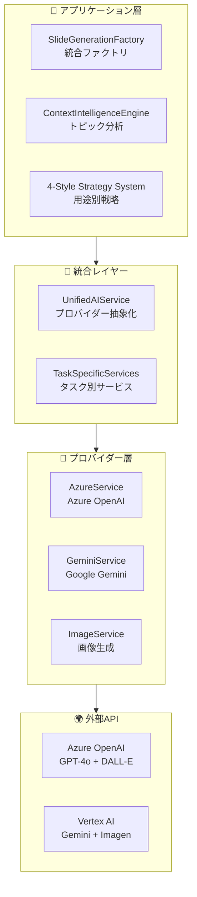
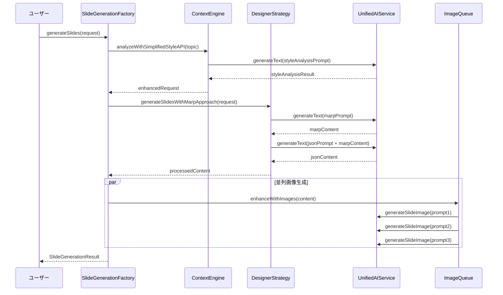

# SlideMaster - AI統合ガイド v2.0

**文書バージョン**: 2.0  
**最終更新日**: 2025年8月13日  
**対象システム**: SlideMaster AI-Powered Presentation Generator  

---

## 1. AI統合アーキテクチャ概要

### 1.1 統合設計の基本思想

**SlideMaster**のAI統合は、以下の核心原則に基づいて設計されています：

- **プロバイダー独立性**: Azure OpenAI、Gemini等の切り替えを容易にする抽象化
- **ファクトリパターン**: AI サービスの生成と管理を統一的に行う
- **Context Intelligence**: トピック分析による自動最適化
- **4スタイル戦略**: 用途別に特化した生成戦略
- **二段階生成**: Marp→JSON方式によるトークン効率化

### 1.2 AI統合レイヤー構成



---

## 2. プロバイダー統合システム

### 2.1 統合AIサービス (UnifiedAIService)

#### **主要インターフェース**
```typescript
export interface UnifiedAIService extends EnhancedAIService {
  generateText(prompt: string, options?: TextGenerationOptions): Promise<string>;
  generateImage(prompt: string, options?: ImageGenerationOptions): Promise<string>;
  generateSlideContent(topic: string, slideCount?: number, enhancedOptions?: EnhancedGenerationOptions): Promise<string>;
  generateSlideImage(prompt: string, options?: SlideImageOptions): Promise<string>;
  analyzeVideo(videoData: string, prompt?: string): Promise<string>;
  testConnection(): Promise<boolean>;
  getMaxTokens(safetyMargin?: number): number;
  getModelInfo(): { service: string; model: string; limits: any } | null;
}
```

#### **プロバイダー実装クラス**

| プロバイダー | 実装クラス | 対応機能 | 設定要件 |
|-------------|------------|----------|----------|
| **Azure OpenAI** | `AzureUnifiedService` | テキスト・画像・動画分析 | endpoint, apiKey, deploymentName |
| **Google Gemini** | `GeminiUnifiedService` | テキスト・画像・動画分析 | apiKey (タスク別設定対応) |

### 2.2 タスク別プロバイダー対応

#### **プロバイダー選択システム**
```typescript
function createTaskSpecificAIService(taskType: 'text' | 'image' | 'video'): UnifiedAIService {
  const settings = getUserSettings();
  
  let provider: string;
  switch (taskType) {
    case 'text':
      provider = settings.aiProviderText || 'azure';
      break;
    case 'image':
      provider = settings.aiProviderImage || 'azure';
      break;
    case 'video':
      provider = settings.aiProviderVideo || 'azure';
      break;
  }
  
  // プロバイダー別サービス生成
  switch (provider) {
    case 'azure':
      return new AzureUnifiedService();
    case 'gemini':
      return new GeminiUnifiedService();
    default:
      throw new AIServiceError(`サポートされていないAIプロバイダーです: ${provider}`);
  }
}
```

#### **設定例**
```typescript
// Azure OpenAI設定
const azureConfig: AzureOpenAIConfig = {
  endpoint: 'https://your-resource.openai.azure.com/',
  apiKey: 'your-api-key',
  apiVersion: '2024-02-01',
  textDeploymentName: 'gpt-4o',
  imageDeploymentName: 'dall-e-3',
  videoDeploymentName: 'gpt-4-vision'
};

// Gemini設定（タスク別）
const geminiConfig = {
  textGeneration: { apiKey: 'text-api-key' },
  imageGeneration: { apiKey: 'image-api-key', modelName: 'imagen-3.0-generate-002' },
  videoAnalysis: { apiKey: 'video-api-key' }
};
```

---

## 3. Context Intelligence Engine

### 3.1 スタイル分析システム

#### **新しい4スタイル戦略**
```typescript
type StyleType = 'simple' | 'education' | 'marketing-oriented' | 'research-presentation-oriented';

interface StyleAnalysisResult {
  selectedStyle: StyleType;
  reason: string;
  confidence: number;
  suggestedSlideCount: number;
  needsPageNumbers: boolean;
  imageConsistencyLevel: 'low' | 'medium' | 'high';
}
```

#### **スタイル別特性**

| スタイル | 適用場面 | 特徴 | デザイン方針 |
|---------|----------|------|-------------|
| **Simple** | ビジネス・技術・学術 | クリーンデザイン、データ可視化 | 構造化レイアウト、論理階層 |
| **Education** | 教育・研修・ストーリー | 大きな文字、親しみやすい色彩 | 視認性重視、イラスト中心 |
| **Marketing** | 商品紹介・営業・ブランディング | ビジュアルインパクト、魅力的配色 | 画像主体、感情訴求 |
| **Research** | 研究発表・学会・分析報告 | 論理的構成、インフォグラフィック | フレームワーク対応、構造図 |

### 3.2 プロンプト管理システム

#### **外部プロンプトファイル構成**
```yaml
# contextIntelligence.yml
simplifiedStyleAnalysis:
  systemPrompt: |
    あなたは優秀なプレゼンテーション分析エキスパートです。
    以下のトピックを分析し、最適なプレゼンテーションスタイルを選択してください。

  styles:
    simple:
      description: "シンプル洗練 - ビジネス・技術・学術向け"
      characteristics: "クリーンデザイン、構造化レイアウト、データ可視化"
      
    education:
      description: "教育最適化 - 教育・研修・ストーリー向け"
      characteristics: "大きな文字、親しみやすい色彩、視認性重視"
      
    marketing-oriented:
      description: "マーケティング志向 - 商品紹介・営業・ブランディング向け"
      characteristics: "ビジュアルインパクト、画像主体、感情訴求"
      
    research-presentation-oriented:
      description: "研究発表志向 - 研究発表・学会・分析報告向け"
      characteristics: "論理的構成、フレームワーク対応、構造図"

  responseFormat: |
    必ず以下のJSON形式で回答してください：
    {
      "selectedStyle": "simple|education|marketing-oriented|research-presentation-oriented",
      "reason": "選択理由",
      "confidence": "0.0-1.0の数値",
      "suggestedSlideCount": "推奨スライド数(5-20)",
      "needsPageNumbers": "true/false",
      "imageConsistencyLevel": "low|medium|high"
    }
```

---

## 4. 二段階生成システム (Marp→JSON)

### 4.1 生成フロー設計



### 4.2 Marp生成フェーズ

#### **第1段階: Marp形式生成**
```typescript
async generateSlidesWithMarpApproach(request: EnhancedSlideRequest): Promise<string> {
  // 1. Marpコンテンツ生成
  const marpPrompt = this.buildMarpPrompt(request);
  const marpContent = await this.aiService.generateText({
    prompt: marpPrompt,
    systemPrompt: 'あなたは優秀なプレゼンテーション構成エキスパートです。',
    temperature: 0.7
  });
  
  // 2. Marp→JSON変換
  const jsonPrompt = this.buildJSONConversionPrompt(marpContent, request);
  const jsonContent = await this.aiService.generateText({
    prompt: jsonPrompt,
    systemPrompt: 'あなたは優秀なレイアウトデザイナーです。',
    temperature: 0.5
  });
  
  return jsonContent;
}
```

#### **Marpプロンプト構造**
```typescript
buildMarpPrompt(request: EnhancedSlideRequest): string {
  return `トピック: ${request.topic}

プレゼンテーション用途: ${request.purpose}
対象者: ${this.getAudienceDescription(request)}
スライド数: ${request.slideCount}枚

以下の要件でMarp形式のプレゼンテーションを作成してください：

## 構成要件
- タイトルスライド（1枚目）
- 本編スライド（${request.slideCount - 1}枚）
- 各スライドは明確な主題を持つ
- ${this.getStyleSpecificRequirements(request)}

## Marp記法
\`\`\`markdown
---
marp: true
theme: default
---

# プレゼンテーションタイトル

---

## スライド1タイトル

- ポイント1
- ポイント2
- ポイント3

---
\`\`\`

**重要**: 純粋なMarkdown記法のみを使用し、HTMLタグは使用しないでください。`;
}
```

### 4.3 JSON変換フェーズ

#### **第2段階: レイアウト変換**
```typescript
buildJSONConversionPrompt(marpContent: string, request: EnhancedSlideRequest): string {
  return `以下のMarpコンテンツを、SlideMasterのレイヤーベースJSON形式に変換してください。

## 入力Marpコンテンツ
${marpContent}

## 変換要件
- 各スライドをレイヤー構造に分解
- テキストレイヤー: type="text"
- 画像レイヤー: type="image" (プレースホルダー)
- 位置座標: パーセンテージ（x, y, width, height: 0-100）

## JSON出力形式
{
  "title": "プレゼンテーションタイトル",
  "description": "プレゼンテーション説明",
  "slides": [
    {
      "id": "slide-1",
      "title": "スライドタイトル",
      "layers": [
        {
          "id": "layer-1-1",
          "type": "text",
          "content": "テキスト内容",
          "x": 10, "y": 15, "width": 80, "height": 15,
          "fontSize": 28,
          "textAlign": "center",
          "textColor": "#000000"
        }
      ],
      "background": "#ffffff"
    }
  ]
}

**重要**: 
- Minified JSON（改行・スペースなし）で出力
- トークン数削減のため簡潔に
- ${this.getLayoutGuidelines(request)}`;
}
```

---

## 5. 4スタイル戦略システム

### 5.1 戦略パターン実装

#### **基底クラス**
```typescript
export abstract class BaseDesignerStrategy implements DesignerStrategy {
  abstract readonly designerId: DesignerType;
  abstract readonly designerName: string;
  
  // 共通メソッド
  abstract buildContentPrompt(request: EnhancedSlideRequest): string;
  abstract buildImagePrompt(slideContent: string, context: any): string;
  abstract buildMarpPrompt(request: EnhancedSlideRequest): string;
  abstract buildJSONConversionPrompt(marpContent: string, request: EnhancedSlideRequest): string;
  abstract generateTitleSlide(request: EnhancedSlideRequest): any;
  abstract postProcessContent(content: string, request: EnhancedSlideRequest): string;
  
  // 新機能: Marp→JSON二段階生成
  async generateSlidesWithMarpApproach(request: EnhancedSlideRequest): Promise<string> {
    // 基底実装（サブクラスでオーバーライド可能）
  }
}
```

#### **具体戦略クラス**

| 戦略クラス | 対応スタイル | 特化機能 |
|-----------|--------------|----------|
| `SimpleStyleStrategy` | Simple | データ可視化、構造化レイアウト |
| `EducationStyleStrategy` | Education | 大きな文字、親しみやすいデザイン |
| `MarketingStyleStrategy` | Marketing | ビジュアルインパクト、商品アピール |
| `ResearchStyleStrategy` | Research | 論理構成、フレームワーク図表 |

### 5.2 スタイル別プロンプト例

#### **SimpleStyleStrategy**
```typescript
buildMarpPrompt(request: EnhancedSlideRequest): string {
  return `${request.topic}について、シンプルで洗練されたビジネスプレゼンテーションを作成してください。

## スタイル要件
- クリーンで読みやすいレイアウト
- データドリブンなアプローチ
- 論理的な構成と階層
- 専門性を重視した内容

## 構成指針
- 要点を3-5個に絞って整理
- 具体例やデータを活用
- 結論を明確に示す

${this.getMarpBaseFormat(request)}`;
}

buildImagePrompt(slideContent: string, context: any): string {
  return `Create a clean, professional image for a business presentation.

Content: ${slideContent}
Style: Simple and refined design
Requirements:
- Modern, minimalist aesthetic
- Professional color scheme
- Data visualization elements where appropriate
- No text overlays or watermarks

Focus on clarity and business professionalism.`;
}
```

#### **EducationStyleStrategy**
```typescript
buildMarpPrompt(request: EnhancedSlideRequest): string {
  return `${request.topic}について、教育・学習に最適化されたプレゼンテーションを作成してください。

## スタイル要件
- 分かりやすく親しみやすい表現
- 段階的な説明構成
- 具体例や体験談を多用
- 学習者の興味を引く内容

## 教育最適化指針
- 概念を身近な例で説明
- 「なぜ」「どうして」を重視
- 覚えやすいポイント整理

${this.getMarpBaseFormat(request)}`;
}

buildImagePrompt(slideContent: string, context: any): string {
  return `Create an educational, friendly image for learning materials.

Content: ${slideContent}
Style: Educational and approachable design
Requirements:
- Clear, large visual elements
- Bright, friendly colors
- Illustrated or iconographic style
- Engaging for learners

Make it educational and welcoming for students.`;
}
```

---

## 6. 画像生成統合システム

### 6.1 スタイル連動画像生成

#### **画像プロンプト強化システム**
```typescript
private enhanceImagePromptWithStyle(
  baseImagePrompt: string,
  styleAnalysis: any,
  slideContent: string,
  slideIndex: number
): string {
  const selectedStyle = styleAnalysis.selectedStyle;
  const styleConfig = this.getImageStyleForNewStyles(selectedStyle);
  
  return `${baseImagePrompt}

${styleConfig.styleInstruction}
Context: ${styleConfig.contextDescription}
${styleConfig.specificGuidelines}
Important: ${styleConfig.prohibitions}
Note: No text overlays, website URLs, or icons8.com imagery.`;
}
```

#### **スタイル別画像設定**
```typescript
private getImageStyleForNewStyles(selectedStyle: StyleType): ImageStyleConfig {
  switch (selectedStyle) {
    case 'simple':
      return {
        styleInstruction: 'Style: Clean, professional imagery with modern design. Use simple compositions and neutral colors.',
        contextDescription: 'Simple and refined presentation design',
        specificGuidelines: 'Focus on clarity and professionalism. Emphasize graphs, charts, and structured layouts.',
        prohibitions: 'NO cluttered visuals, excessive decoration, or overly complex compositions.'
      };

    case 'education':
      return {
        styleInstruction: 'Style: Clear, educational imagery with large, readable elements. Use friendly colors and approachable design.',
        contextDescription: 'Educational and learning-focused presentation',
        specificGuidelines: 'Make it engaging for learners. Use illustrations, icons, and step-by-step visual guidance.',
        prohibitions: 'NO complex professional graphs, overly technical imagery, or intimidating visual elements.'
      };

    case 'marketing-oriented':
      return {
        styleInstruction: 'Style: Dynamic, visually impactful imagery showcasing products and services. Use attractive colors and compelling compositions.',
        contextDescription: 'Marketing and visual-oriented presentation',
        specificGuidelines: 'Focus on product photography style, attractive visuals for marketing materials.',
        prohibitions: 'NO boring layouts, academic formality, or conservative design elements.'
      };

    case 'research-presentation-oriented':
      return {
        styleInstruction: 'Style: Structured, analytical imagery with focus on data and frameworks. Use infographic-style visuals.',
        contextDescription: 'Research and analytical presentation',
        specificGuidelines: 'Emphasize logical frameworks like PDCA cycles, SWOT diagrams, and structured infographics.',
        prohibitions: 'NO decorative imagery, emotional appeals, or non-analytical visual elements.'
      };
  }
}
```

### 6.2 並列画像生成システム

#### **画像生成キュー**
```typescript
export class ImageGenerationQueue {
  private maxConcurrency = 3;
  private queue: ImageGenerationTask[] = [];
  private running: Set<string> = new Set();
  
  async addToQueue(task: ImageGenerationTask): Promise<string> {
    return new Promise((resolve, reject) => {
      const taskWithCallbacks = {
        ...task,
        resolve,
        reject
      };
      
      this.queue.push(taskWithCallbacks);
      this.processQueue();
    });
  }
  
  private async processQueue(): Promise<void> {
    while (this.queue.length > 0 && this.running.size < this.maxConcurrency) {
      const task = this.queue.shift()!;
      this.executeTask(task);
    }
  }
}
```

---

## 7. エラーハンドリング & 回復システム

### 7.1 JSON修復システム

#### **高度JSON修復機能**
```typescript
private attemptJSONRepair(content: string): string | null {
  try {
    let repairedContent = content.trim();
    
    // 不正な制御文字を除去
    repairedContent = repairedContent.replace(/[\x00-\x08\x0B\x0C\x0E-\x1F\x7F]/g, '');
    
    // 最後の完全な構造を見つける
    const lastCompleteStructure = this.findLastCompleteStructure(repairedContent);
    if (lastCompleteStructure) {
      repairedContent = repairedContent.substring(0, lastCompleteStructure + 1);
    }
    
    // 構造修復
    const structureResult = this.repairJSONStructure(repairedContent);
    if (structureResult) {
      return structureResult;
    }
    
    // 最小限の有効なJSONを生成
    return this.createMinimalValidJSON(content);
    
  } catch (error) {
    return this.createEmergencyJSON();
  }
}

private createMinimalValidJSON(originalContent: string): string {
  const titleMatch = originalContent.match(/"title"\s*:\s*"([^"]*)"/) || 
                    originalContent.match(/"title"\s*:\s*'([^']*)'/) || 
                    originalContent.match(/title:\s*["']([^"']*)/);
  
  const title = titleMatch ? titleMatch[1] : "プレゼンテーション";
  
  return JSON.stringify({
    title: title,
    description: "自動生成されたプレゼンテーション",
    slides: [
      {
        id: "slide-1",
        title: title,
        layers: [
          {
            id: "layer-1-1",
            type: "text",
            content: title,
            x: 10, y: 20, width: 80, height: 20,
            fontSize: 32,
            textAlign: "center",
            textColor: "#000000"
          }
        ],
        background: "#ffffff"
      }
    ]
  }, null, 2);
}
```

### 7.2 APIエラー対応

#### **リトライ機構**
```typescript
export class AIServiceError extends Error {
  constructor(
    message: string, 
    public provider?: string, 
    public code?: string
  ) {
    super(message);
    this.name = 'AIServiceError';
  }
}

async function withRetry<T>(
  operation: () => Promise<T>,
  maxRetries: number = 3,
  backoffMs: number = 1000
): Promise<T> {
  for (let attempt = 1; attempt <= maxRetries; attempt++) {
    try {
      return await operation();
    } catch (error) {
      if (attempt === maxRetries) {
        throw error;
      }
      
      const delay = backoffMs * Math.pow(2, attempt - 1);
      await new Promise(resolve => setTimeout(resolve, delay));
    }
  }
  
  throw new Error('Unreachable');
}
```

---

## 8. 設定管理システム

### 8.1 プロバイダー設定構造

#### **Azure OpenAI設定**
```typescript
export interface AzureOpenAIConfig {
  endpoint: string;
  apiKey: string;
  apiVersion?: string;
  textDeploymentName: string;
  imageDeploymentName: string;
  videoDeploymentName?: string;
  // 専用エンドポイント設定
  imageEndpoint?: string;
  imageApiKey?: string;
  imageApiVersion?: string;
  videoEndpoint?: string;
  videoApiKey?: string;
  videoApiVersion?: string;
}
```

#### **Gemini設定（タスク別）**
```typescript
export interface GeminiConfig {
  textGeneration: {
    apiKey: string;
    modelName?: string;
  };
  imageGeneration: {
    apiKey: string;
    modelName?: string;
  };
  videoAnalysis: {
    apiKey: string;
    modelName?: string;
  };
}
```

### 8.2 設定検証システム

#### **詳細検証機能**
```typescript
export function validateAIConfiguration(
  taskType: 'text' | 'image' | 'video' = 'text'
): { valid: boolean; errors: string[] } {
  const errors: string[] = [];
  const settings = getUserSettings();
  
  const provider = getProviderForTask(taskType, settings);
  const taskKey = getTaskKey(taskType);
  
  switch (provider) {
    case 'azure':
      const azureAuth = settings.providerAuth?.azure?.[taskKey];
      if (!azureAuth?.apiKey) {
        errors.push(`Azure OpenAI APIキーが設定されていません（${taskType}）`);
      }
      if (!azureAuth?.endpoint) {
        errors.push(`Azure OpenAI エンドポイントが設定されていません（${taskType}）`);
      }
      if (taskType === 'text') {
        const deploymentName = settings.aiModels?.textGeneration;
        if (!deploymentName || deploymentName.trim() === '') {
          errors.push('テキスト生成のデプロイメント名が設定されていません');
        }
      }
      break;
      
    case 'gemini':
      const geminiAuth = settings.providerAuth?.gemini?.[taskKey];
      if (!geminiAuth?.apiKey) {
        errors.push(`Gemini APIキーが設定されていません（${taskType}）`);
      }
      break;
      
    default:
      errors.push(`サポートされていないプロバイダーです: ${provider}`);
  }
  
  return { valid: errors.length === 0, errors };
}
```

---

## 9. パフォーマンス最適化

### 9.1 トークン効率化

#### **Minified JSON採用**
```typescript
// トークン数削減のため、改行・スペースを除去
const minifiedPrompt = `JSON出力は必ずMinified形式（改行・スペースなし）で行ってください。
例: {"title":"タイトル","slides":[{"id":"slide-1","title":"スライド1",...}]}

この形式により、トークン使用量を約50%削減できます。`;
```

#### **並列処理最適化**
```typescript
// 画像生成の並列実行
const imageGenerationPromises = slides.map(async (slide, index) => {
  if (slide.needsImage) {
    const imagePrompt = generateImagePrompt(slide, context);
    return await imageService.generateSlideImage(imagePrompt, {
      size: 'landscape',
      quality: 'high'
    });
  }
  return null;
});

const generatedImages = await Promise.all(imageGenerationPromises);
```

### 9.2 メモリ効率化

#### **ストリーミング処理**
```typescript
// 大きなJSONレスポンスのストリーミング処理
export async function processLargeJSONResponse(
  response: ReadableStream<Uint8Array>
): Promise<any> {
  const reader = response.getReader();
  let buffer = '';
  
  try {
    while (true) {
      const { done, value } = await reader.read();
      if (done) break;
      
      buffer += new TextDecoder().decode(value);
      
      // 部分的なJSONパースを試行
      const partialResult = attemptPartialParse(buffer);
      if (partialResult) {
        yield partialResult;
      }
    }
  } finally {
    reader.releaseLock();
  }
}
```

---

## 10. モニタリング & デバッグ

### 10.1 生成過程の追跡

#### **詳細ログシステム**
```typescript
export class AIGenerationTracker {
  private logs: GenerationLog[] = [];
  
  logContextAnalysis(topic: string, result: any): void {
    this.logs.push({
      timestamp: Date.now(),
      phase: 'context_analysis',
      input: { topic },
      output: result,
      duration: result.processingTime
    });
  }
  
  logMarpGeneration(prompt: string, result: string): void {
    this.logs.push({
      timestamp: Date.now(),
      phase: 'marp_generation',
      input: { promptLength: prompt.length },
      output: { contentLength: result.length },
      metadata: { tokenEstimate: this.estimateTokens(prompt + result) }
    });
  }
  
  logJSONConversion(marpContent: string, jsonResult: string): void {
    this.logs.push({
      timestamp: Date.now(),
      phase: 'json_conversion',
      input: { marpLength: marpContent.length },
      output: { jsonLength: jsonResult.length },
      metadata: { 
        compressionRatio: jsonResult.length / marpContent.length 
      }
    });
  }
  
  generateReport(): GenerationReport {
    return {
      totalPhases: this.logs.length,
      totalDuration: this.getTotalDuration(),
      phaseBreakdown: this.getPhaseBreakdown(),
      performanceMetrics: this.getPerformanceMetrics()
    };
  }
}
```

### 10.2 エラー監視

#### **包括的エラー追跡**
```typescript
export class AIErrorMonitor {
  private errorHistory: AIError[] = [];
  
  recordError(error: Error, context: AIOperationContext): void {
    const aiError: AIError = {
      timestamp: Date.now(),
      errorType: error.constructor.name,
      message: error.message,
      context: {
        provider: context.provider,
        operation: context.operation,
        requestSize: context.requestSize
      },
      stack: error.stack,
      recoveryAction: this.determineRecoveryAction(error)
    };
    
    this.errorHistory.push(aiError);
    this.notifyIfCritical(aiError);
  }
  
  getErrorStats(): ErrorStats {
    return {
      totalErrors: this.errorHistory.length,
      errorsByProvider: this.groupByProvider(),
      errorsByType: this.groupByType(),
      recoverySuccessRate: this.calculateRecoveryRate()
    };
  }
}
```

---

## 11. 今後の拡張計画

### 11.1 プロバイダー拡張

#### **新プロバイダー対応準備**
```typescript
// 将来の拡張例
interface NewProviderService extends UnifiedAIService {
  // 新プロバイダー固有の機能
  generateAdvancedVisuals(prompt: string): Promise<string>;
  analyzeComplexData(data: any): Promise<AnalysisResult>;
}

// プラグインアーキテクチャ対応
export interface AIProviderPlugin {
  name: string;
  version: string;
  supportedTasks: TaskType[];
  createService(config: any): UnifiedAIService;
  validateConfig(config: any): ValidationResult;
}
```

### 11.2 AI機能強化

#### **次世代機能**
- **マルチモーダル統合**: テキスト・画像・音声の統合処理
- **リアルタイム協調**: 複数AIの協調生成
- **学習システム**: ユーザー嗜好の学習と適応
- **品質評価**: 生成品質の自動評価システム

---

**このAI統合ガイドにより、SlideMasterの高度なAI機能と拡張性の高いアーキテクチャを理解できます。プロバイダー独立性とパフォーマンス最適化を両立した設計により、将来の技術進歩にも柔軟に対応できる基盤となっています。**