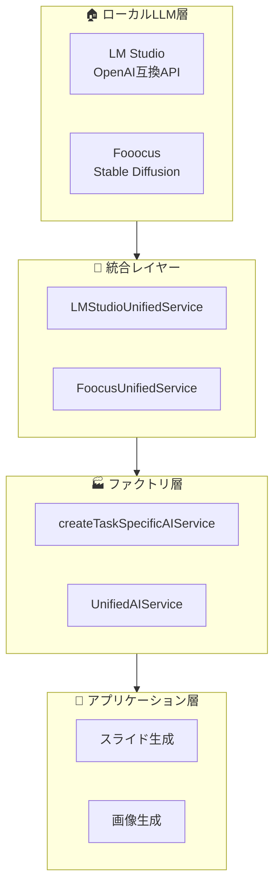

# SlideMaster - ローカルLLM統合ガイド v1.0

**文書バージョン**: 1.0  
**最終更新日**: 2025年8月13日  
**対象システム**: SlideMaster AI-Powered Presentation Generator  

---

## 1. ローカルLLM統合概要

### 1.1 新規追加プロバイダー

**SlideMaster**に以下のローカルLLMプロバイダーが追加されました：

#### **LM Studio（テキスト生成）**
- **用途**: ローカルLLMによるテキスト・スライドコンテンツ生成
- **API**: OpenAI互換API
- **対応モデル**: Gemma-3n-e4b, Gemma-3-4b, deepseek-r1, phi-4-mini-reasoning
- **デフォルトエンドポイント**: http://localhost:1234

#### **Fooocus（画像生成）**
- **用途**: ローカルStable Diffusionによる画像生成
- **API**: Stable Diffusion WebUI互換API
- **対応モデル**: Stable Diffusion XL, Stable Diffusion Turbo
- **デフォルトエンドポイント**: http://localhost:7865

### 1.2 統合アーキテクチャ



---

## 2. 実装ファイル構成

### 2.1 新規作成ファイル

| ファイル | 説明 | 役割 |
|---------|------|------|
| `services/ai/localLLMConfig.ts` | ローカルLLM設定インターフェース | 設定・バリデーション |
| `services/ai/localLLMTypes.ts` | 型定義拡張 | TypeScript型定義 |
| `services/ai/lmStudioService.ts` | LMStudioサービス実装 | OpenAI互換API |
| `services/ai/foocusService.ts` | Foocusサービス実装 | 画像生成API |
| `services/ai/localLLMUnifiedService.ts` | 統合サービス実装 | UnifiedAIService統合 |
| `services/ai/localLLMTestUtils.ts` | テスト・診断ユーティリティ | 開発・デバッグ支援 |
| `docs/07_Local_LLM_Integration.md` | 統合ガイド | 本ドキュメント |

### 2.2 拡張済みファイル

| ファイル | 変更内容 |
|---------|----------|
| `services/ai/unifiedAIService.ts` | ファクトリ関数・バリデーション拡張 |
| `services/ai/aiServiceInterface.ts` | AIProviderType拡張 |
| `components/TaskBasedAIProviderSettings.tsx` | UI設定対応 |

---

## 3. 設定・使用方法

### 3.1 LM Studio設定

#### **必要な設定項目**
```typescript
{
  endpoint: 'http://localhost:1234',      // LMStudioサーバーエンドポイント
  apiKey: '',                             // APIキー（オプション）
  modelName: 'Gemma 3 4B'                // 表示用モデル名
}
```

#### **推奨モデル**
- **Gemma 3n E4B** (推奨・軽量): ~4GB
- **Gemma 3 4B** (推奨・バランス): ~4GB  
- **Phi 4 Mini Reasoning** (推奨・軽量): ~3GB
- **DeepSeek R1** (推論特化): ~7GB

### 3.2 Fooocus設定

#### **必要な設定項目**
```typescript
{
  endpoint: 'http://localhost:7865',      // Foocusサーバーエンドポイント
  authToken: '',                          // 認証トークン（オプション）
  modelName: 'Stable Diffusion XL'       // モデル名
}
```

#### **推奨モデル**
- **Stable Diffusion XL** (推奨): ~7GB
- **Stable Diffusion Turbo** (高速): ~5GB

### 3.3 設定画面での選択

#### **タスク別プロバイダー選択**
- **テキスト生成**: Azure OpenAI, Google Gemini, **LM Studio**
- **画像生成**: Azure OpenAI, Google Gemini, **Fooocus**
- **動画分析**: Azure OpenAI, Google Gemini（ローカルLLM未対応）

---

## 4. API仕様

### 4.1 LM Studio API

#### **テキスト生成**
```typescript
// OpenAI互換エンドポイント
POST /v1/chat/completions
{
  "model": "local-model",
  "messages": [
    {"role": "system", "content": "システムプロンプト"},
    {"role": "user", "content": "ユーザープロンプト"}
  ],
  "temperature": 0.7,
  "max_tokens": 2048
}
```

#### **モデル一覧取得**
```typescript
GET /v1/models
```

### 4.2 Fooocus API

#### **画像生成**
```typescript
POST /sdapi/v1/txt2img
{
  "prompt": "画像生成プロンプト",
  "negative_prompt": "除外プロンプト", 
  "width": 1024,
  "height": 1024,
  "steps": 30,
  "cfg_scale": 7.0
}
```

#### **進行状況取得**
```typescript
GET /sdapi/v1/progress
```

---

## 5. 開発・デバッグ

### 5.1 診断ツール

#### **包括的診断**
```typescript
import { runLocalLLMDiagnostics } from './services/ai/localLLMTestUtils';

const results = await runLocalLLMDiagnostics();
console.log(results);
```

#### **クイックチェック**
```typescript
import { quickLocalLLMCheck } from './services/ai/localLLMTestUtils';

const status = await quickLocalLLMCheck();
console.log(status.summary);
```

#### **ブラウザコンソールでのテスト**
```javascript
// 自動的にグローバル関数として公開
await testLocalLLM();           // 包括的診断
await quickLocalLLMCheck();     // クイックチェック
printLocalLLMDebugInfo();       // デバッグ情報表示
```

### 5.2 診断結果の例

```typescript
{
  lmstudio: {
    available: true,
    endpoint: "http://localhost:1234",
    connectionTest: true,
    configValidation: { valid: true, errors: [] },
    serverInfo: { status: "connected", model: "gemma-3-4b" },
    models: ["gemma-3-4b", "phi-4-mini"],
    testGeneration: { 
      success: true, 
      result: "Test successful - LMStudio is working!" 
    }
  },
  fooocus: {
    available: true,
    endpoint: "http://localhost:7865", 
    connectionTest: true,
    configValidation: { valid: true, errors: [] },
    serverInfo: { status: "connected", model: "Stable Diffusion XL" },
    testGeneration: { 
      success: true, 
      result: "Generated image (12543 characters)" 
    }
  }
}
```

---

## 6. トラブルシューティング

### 6.1 よくある問題

#### **LM Studio接続エラー**
| エラー | 原因 | 解決方法 |
|--------|------|----------|
| `Connection refused` | LMStudioが起動していない | LMStudioを起動してモデルをロード |
| `Invalid endpoint` | エンドポイントURL間違い | `http://localhost:1234`を確認 |
| `Model not loaded` | モデルが未ロード | LMStudio上でモデルを選択・ロード |

#### **Fooocus接続エラー**
| エラー | 原因 | 解決方法 |
|--------|------|----------|
| `Service unavailable` | Foocusが起動していない | Foocusを起動してWebUIを確認 |
| `Invalid endpoint` | エンドポイントURL間違い | `http://localhost:7865`を確認 |
| `Model download in progress` | モデルダウンロード中 | ダウンロード完了まで待機 |

### 6.2 パフォーマンス最適化

#### **LM Studio推奨設定**
```typescript
{
  maxTokens: 2048,        // トークン数を適切に制限
  temperature: 0.7,       // 生成品質と速度のバランス
  contextLength: 4096,    // コンテキスト長の調整
}
```

#### **Fooocus推奨設定**
```typescript
{
  steps: 20,              // 高速生成なら15-20
  guidance_scale: 7.0,    // 標準的な値
  width: 1024,            // 適切な解像度
  height: 1024,
  sampler: 'DPM++ 2M Karras'  // 推奨サンプラー
}
```

---

## 7. セキュリティ考慮事項

### 7.1 ローカル環境のセキュリティ

#### **ネットワークアクセス制御**
- LMStudio/Foocusは`localhost`バインドを推奨
- 外部公開する場合は適切な認証・暗号化を実装
- ファイアウォール設定でポートアクセスを制限

#### **プロンプトインジェクション対策**
```typescript
// プロンプトサニタイゼーション例
function sanitizePrompt(prompt: string): string {
  return prompt
    .replace(/[<>]/g, '')           // HTMLタグ除去
    .replace(/javascript:/g, '')    // スクリプト除去
    .substring(0, 4000);           // 長さ制限
}
```

### 7.2 データプライバシー

#### **ローカル処理の利点**
- データが外部サーバーに送信されない
- 機密情報の漏洩リスクを最小化
- 企業内での安全な利用が可能

---

## 8. 将来の拡張計画

### 8.1 追加予定機能

#### **新しいローカルLLMサポート**
- **Ollama**: ローカルLLM管理ツール
- **LM Studio代替**: 他のローカルLLMフレームワーク
- **ComfyUI**: 高度な画像生成ワークフロー

#### **高度な統合機能**
- **マルチモデル並列処理**: 複数ローカルLLMの同時利用
- **自動モデル選択**: タスクに応じた最適モデル選択
- **パフォーマンス監視**: リソース使用量の可視化

### 8.2 拡張ポイント

#### **新プロバイダー追加手順**
1. `services/ai/newProviderService.ts` 作成
2. `services/ai/newProviderUnifiedService.ts` 実装
3. `localLLMTypes.ts` の型定義拡張
4. `unifiedAIService.ts` のファクトリ拡張
5. UI設定の追加

---

## 9. パフォーマンス指標

### 9.1 推奨システム要件

#### **LM Studio**
- **RAM**: 8GB以上（モデルサイズ + 4GB）
- **ストレージ**: 10GB以上（モデル保存用）
- **CPU**: 4コア以上推奨

#### **Fooocus**
- **GPU**: VRAM 6GB以上推奨（NVIDIA）
- **RAM**: 8GB以上
- **ストレージ**: 15GB以上（モデル保存用）

### 9.2 パフォーマンス目標

#### **生成速度**
- **テキスト生成**: 10-50 tokens/秒
- **画像生成**: 20-60秒/画像（設定依存）
- **スライド生成**: 2-5分/プレゼンテーション

---

**このローカルLLM統合により、SlideMasterは完全にオフラインでの高品質なプレゼンテーション生成が可能になりました。企業環境での安全な利用と、プライバシーを重視したAI活用を実現します。**